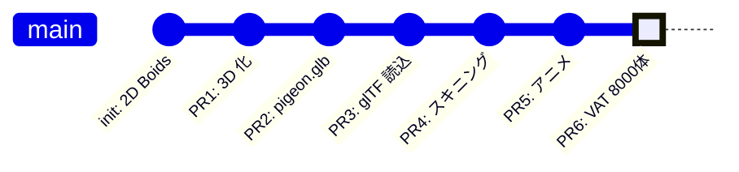

# boids-webgpu

WebGPU の compute shader を使った 3D Boids（群行動）シミュレーション。**8000 羽のハト**が群行動則に従って飛び、各個体がスケルタルアニメで羽ばたきます。

ブラウザだけで動きます。WebGL ではなく **WebGPU** を選ぶことで、群れの近傍探索を GPU の並列計算で素直に書けるようにしています。

## デモ

> 公開（GitHub Pages）後にスクリーンショット/録画を貼ります。

操作:
- 左ドラッグ: 群れを引き寄せる
- 右ドラッグ: 群れを散らす
- Pause ボタン: 時間を止める

## 動作要件

WebGPU 対応ブラウザが必要です。

| ブラウザ | 対応 |
|---------|------|
| Chrome 113+ / Edge 113+ | ✅ 安定対応 |
| Safari 26+ | ✅ 安定対応 |
| Firefox | ⚠️ 最近対応（バージョンによる） |

## クイックスタート

```bash
git clone https://github.com/kimata1007/boids-webgpu.git
cd boids-webgpu
npm install
npm run dev
```

`http://localhost:5173/` を開きます。

### ハトのモデルを再生成する場合

通常は `public/pigeon.glb` と `public/pigeon_vat.bin` がリポジトリに同梱されているので不要ですが、Blender スクリプトを書き換えた場合は再生成します。

```bash
# Blender 5.x が必要 (macOS では brew install --cask blender)
/Applications/Blender.app/Contents/MacOS/Blender --background --python tools/make_pigeon.py
/Applications/Blender.app/Contents/MacOS/Blender --background --python tools/bake_vat.py
```

## プロジェクト構成

```
boids-webgpu/
├── docs/                     設計書（WebGPU 入門 + PR ごとの解説）
├── public/
│   ├── pigeon.glb            ハトの 3D モデル（リグ + 羽ばたきアニメ付き）
│   ├── pigeon_vat.bin        Vertex Animation Texture (32 フレーム × 752 頂点)
│   └── pigeon_vat.json       VAT メタデータ
├── src/
│   ├── gltf/loader.ts        ゼロ依存の GLB パーサ
│   ├── lib/mat4.ts           自前の 4×4 行列ヘルパー
│   ├── shaders/compute.wgsl  Boid シミュレーション
│   ├── shaders/render.wgsl   VAT サンプル + Lambert 照明
│   └── main.ts               初期化 〜 メインループ
└── tools/
    ├── make_pigeon.py        Blender でハトを生成するスクリプト
    ├── bake_vat.py           アニメーションを VAT に焼き出すスクリプト
    └── inspect_glb.py        GLB の中身を検証するツール
```

詳細は [docs/README.md](./docs/README.md) を参照してください。WebGPU を初めて触る読者でも、最後まで読めばこのプロジェクトを再現できる構成にしています。

## 技術スタック

- **WebGPU** + **WGSL** — GPU 計算と描画
- **TypeScript** + **Vite** — フロントエンド開発
- **Blender 5.1** + **Python** — 3D アセットの生成と VAT 焼き出し
- **glTF 2.0 (GLB)** — 3D データ形式
- 外部ライブラリ依存はなし（`@webgpu/types` のみ型情報）

## ロードマップ進捗



| PR | 内容 | 状態 |
|----|------|------|
| PR1 | 3D シーン化（透視カメラ + 深度バッファ） | ✅ |
| PR2 | Blender Python でハトの 3D アセット生成 | ✅ |
| PR3 | glTF ローダーと静的描画 | ✅ |
| PR4 | スキニング（ボーンで翼を曲げる） | ✅ |
| PR5 | アニメーション再生（時間軸でループ） | ✅ |
| PR6 | VAT で 8000 体に拡張 | ✅ |

各 PR の詳細は [docs/02-roadmap.md](./docs/02-roadmap.md) と [docs/pr/](./docs/pr/) にあります。

## アーキテクチャ概要

```
                ┌──────────────────────────┐
                │   メインループ (60 fps)    │
                └────┬─────────────────────┘
                     │
         ┌───────────▼────────────┐
         │  Compute Pass          │  8000 体の Boid を並列更新
         │  (compute.wgsl)        │  群行動則 + マウス力 + 速度制限
         └───────────┬────────────┘
                     │
         ┌───────────▼────────────┐
         │  Render Pass           │  VAT から頂点位置を取得
         │  (render.wgsl)         │  Boid の位置・向きで配置
         │  ・8000 インスタンス    │  Lambert 照明
         │  ・各個体に位相オフセット │
         └────────────────────────┘
```

主な GPU リソース:

| リソース | 内容 |
|---------|------|
| Storage Buffer × 2 | Boid 配列 (ピンポンバッファ) |
| Uniform Buffer × 2 | パラメータ・カメラ行列 |
| Texture (rgba16float) | VAT (32 frames × 752 vertices) |
| Vertex Buffer | bind-pose の法線のみ |
| Depth Texture (depth24plus) | 奥行き判定 |

## 設計の特徴

- **ゼロ依存** — Three.js も gl-matrix も使わず、glTF パーサも 4×4 行列も自前。WebGPU の API を理解する目的のため
- **段階的構築** — 6 本の PR に分割し、各段階で動くものを保つ。スキニング → アニメ → VAT と進化する設計
- **VAT による群衆最適化** — ランタイムでスキニング計算をせず、テクスチャ参照で済ませる。8000 体描画でも GPU 帯域がほぼ消費されない

## ライセンス

未定（公開時に決定）。

## 著者

[@kimata1007](https://github.com/kimata1007)

学習目的のプロジェクトです。
