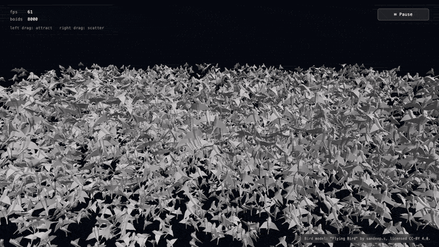

# boids-webgpu

WebGPU の compute shader を使った 3D Boids（群行動）シミュレーション。**8000 羽の鳥**が群行動則に従って飛び、各個体が独立した位相で羽ばたきます。3D モデルには Sketchfab の CC-BY モデル ["Flying Bird" by sandeep.s](https://sketchfab.com/3d-models/flying-bird-eb843194e06d429ebef7dd4aa7e265c1) を使用しています。

ブラウザだけで動きます。WebGL ではなく **WebGPU** を選ぶことで、群れの近傍探索を GPU の並列計算で素直に書けるようにしています。

## デモ

[**▶ ライブデモ (GitHub Pages)**](https://kimata1007.github.io/boids-webgpu/)



操作:
- 左ドラッグ: 群れを引き寄せる
- 右ドラッグ: 群れを散らす
- Pause ボタン: 時間を止める

## 動作要件

WebGPU 対応ブラウザが必要です。

| ブラウザ | 対応 |
|---------|------|
| Chrome 113+ / Edge 113+ | ✅ 安定対応 |
| Safari 26+ | ✅ 安定対応 |
| Firefox | ⚠️ 最近対応（バージョンによる） |

## クイックスタート

```bash
git clone https://github.com/kimata1007/boids-webgpu.git
cd boids-webgpu
npm install
npm run dev
```

`http://localhost:5173/` を開きます。

### VAT を再生成する場合

通常は `public/flying_bird_static.glb` と `public/flying_bird_vat.bin` がリポジトリに同梱されているので不要です。Sketchfab モデルや Blender スクリプトを差し替えた場合のみ実行してください。

```bash
# Blender 5.x が必要 (macOS では brew install --cask blender)
/Applications/Blender.app/Contents/MacOS/Blender --background --python tools/bake_flying_bird.py
```

## プロジェクト構成

```
boids-webgpu/
├── public/
│   ├── flying_bird_static.glb  Sketchfab由来の鳥モデル(3メッシュ統合済み・静的)
│   ├── flying_bird_vat.bin     Vertex Animation Texture (32フレーム × 529頂点)
│   ├── flying_bird_vat.json    VAT メタデータ
│   └── sketchfab/              元データ(Sketchfabからダウンロードした.glb)
├── src/
│   ├── gltf/loader.ts        ゼロ依存の GLB パーサ
│   ├── lib/mat4.ts           自前の 4×4 行列ヘルパー
│   ├── shaders/compute.wgsl  Boid シミュレーション
│   ├── shaders/render.wgsl   VAT サンプル + Lambert 照明
│   └── main.ts               初期化 〜 メインループ
└── tools/
    ├── bake_flying_bird.py   Sketchfab鳥モデル → 統合 + VAT焼き出し
    ├── inspect_glb.py        GLB の中身を検証するツール
    └── capture_demo.mjs      公開サイトを録画して README 用デモ GIF を生成
```

## 技術スタック

- **WebGPU** + **WGSL** — GPU 計算と描画
- **TypeScript** + **Vite** — フロントエンド開発
- **Blender 5.1** + **Python** — 3D アセットの生成と VAT 焼き出し
- **glTF 2.0 (GLB)** — 3D データ形式

## アーキテクチャ概要

```
                ┌──────────────────────────┐
                │   メインループ (60 fps)    │
                └────┬─────────────────────┘
                     │
         ┌───────────▼────────────┐
         │  Compute Pass          │  8000 体の Boid を並列更新
         │  (compute.wgsl)        │  群行動則 + マウス力 + 速度制限
         └───────────┬────────────┘
                     │
         ┌───────────▼────────────┐
         │  Render Pass           │  VAT から頂点位置を取得
         │  (render.wgsl)         │  Boid の位置・向きで配置
         │  ・8000 インスタンス    │  Lambert 照明
         │  ・各個体に位相オフセット │
         └────────────────────────┘
```

主な GPU リソース:

| リソース | 内容 |
|---------|------|
| Storage Buffer × 2 | Boid 配列 (ピンポンバッファ) |
| Uniform Buffer × 2 | パラメータ・カメラ行列 |
| Texture (rgba16float) | VAT (32 frames × 752 vertices) |
| Vertex Buffer | bind-pose の法線のみ |
| Depth Texture (depth24plus) | 奥行き判定 |

## クレジット

3D モデル:
- **"Flying Bird"** by [sandeep.s](https://sketchfab.com/sandeep.s) — Sketchfab
- 元 URL: https://sketchfab.com/3d-models/flying-bird-eb843194e06d429ebef7dd4aa7e265c1
- ライセンス: [Creative Commons Attribution 4.0 International (CC-BY 4.0)](https://creativecommons.org/licenses/by/4.0/)
- 改変: 本プロジェクトでは Blender で 3 メッシュを統合し、各フレームの頂点位置を Vertex Animation Texture (rgba16f) に焼き出して使用しています

## ライセンス

このプロジェクトは **デュアルライセンス**で公開しています。

| 対象 | ライセンス |
|------|-----------|
| コード（`src/`, `tools/`, 設定ファイル等） | [MIT License](./LICENSE) |
| 3D モデル（`public/sketchfab/flying_bird.glb` および派生の `flying_bird_static.glb` / `flying_bird_vat.bin`） | [CC-BY 4.0](https://creativecommons.org/licenses/by/4.0/) (sandeep.s) |

- **コードの再利用**: MIT として自由に可能。LICENSE ファイルの同梱で OK
- **3D モデルの再利用**: CC-BY 4.0 の attribution（著者・URL・ライセンス・改変有無の表示）が必要

詳細は [LICENSE](./LICENSE) を参照してください。

## 著者

@claude
学習目的のプロジェクトです。
