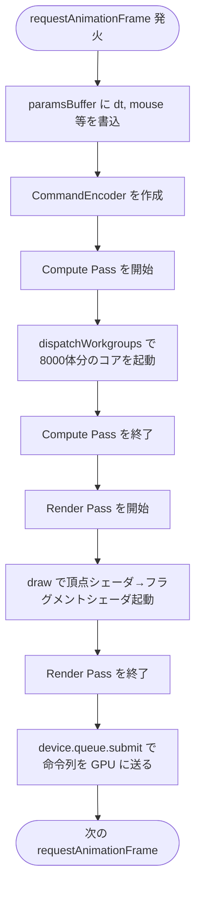

# 00. WebGPU 入門

> このページの目標: 「WebGPU で何かを描く」とはどういう手続きか、頭の中に流れ図を持てるようにすること。

## 1. GPU とは何か

普通のプログラムは **CPU**（Central Processing Unit）で動きます。
CPU は「複雑な処理を 1 つずつ順番に高速に行う」のが得意です。

それに対して **GPU**（Graphics Processing Unit）は「単純な処理をものすごい数、同時並列に行う」のが得意です。

```
CPU のイメージ:
  ┌───┐  処理1 → 処理2 → 処理3 → 処理4 → ...
  │ 1 │   速いけど 1 個ずつ
  └───┘

GPU のイメージ:
  ┌───┬───┬───┬───┬───┬───┬───┬───┐
  │ 1 │ 2 │ 3 │ 4 │ 5 │ 6 │ 7 │ 8 │ ... 数千コア
  └───┴───┴───┴───┴───┴───┴───┴───┘
   全コアが同じ処理を別データに対して同時実行
```

たとえば 8000 羽のハトの位置を更新する場合、CPU だと 8000 回ループしますが、GPU なら 8000 個のコアが**同時に 1 羽ずつ担当**して 1 回で終わります。

> このように同じ処理を多数の要素に並列適用するスタイルを **SIMD**（Single Instruction Multiple Data）と呼びます。3D 描画は典型的な SIMD 仕事です。

## 2. WebGPU とは

**WebGPU** はブラウザから GPU を直接使うための新しい仕様です。W3C で標準化が進んでいます。

歴史的経緯:

| 名前 | 何 | いつ |
|------|-----|------|
| OpenGL | デスクトップ GPU の API | 1992〜 |
| OpenGL ES | モバイル向けの軽量版 | 2003〜 |
| **WebGL** | OpenGL ES をブラウザで使えるようにしたもの | 2011〜 |
| Vulkan / Metal / DirectX12 | 現代的・低レベル GPU API（各 OS 専用） | 2015〜 |
| **WebGPU** | Vulkan/Metal/DirectX12 世代をブラウザに | 2023 安定化〜 |

WebGL（旧）と WebGPU（新）の主な違い:

| | WebGL | WebGPU |
|---|---|---|
| ベース | OpenGL ES（古い設計） | Vulkan/Metal/DirectX12（モダン設計） |
| Compute Shader | **使えない** | **使える** ⭐ |
| 並列計算 | 描画として無理やり実装 | 一級市民として扱える |
| シェーダ言語 | GLSL | **WGSL**（新言語） |
| エラー検知 | 雑（GL_ERROR をいちいち聞く） | 厳格（型・メモリレイアウト） |
| 対応ブラウザ | ほぼ全部 | Chrome/Edge は安定、Safari 26+、Firefox 最近対応 |

このプロジェクトで WebGPU を選んだ理由は、**Compute Shader** が使えることです。8000 羽の Boid の群行動則を毎フレーム並列計算するのに、これは事実上必須です。

## 3. シェーダ（Shader）とは

**シェーダ**とは、GPU 上で動く小さなプログラムです。CPU 用のプログラムと同じく、関数として記述します。

WebGPU では **WGSL**（WebGPU Shading Language）という、Rust と C を混ぜたような言語で書きます。

WGSL の例（足し算）:

```wgsl
@compute @workgroup_size(64)
fn add(@builtin(global_invocation_id) gid: vec3<u32>) {
  let i = gid.x;
  output[i] = a[i] + b[i];
}
```

ここで `@compute` は「これは計算用シェーダだよ」という印、`@workgroup_size(64)` は「64 個一組で動かす」という指示です。`gid.x` が「私は何番目のコア?」を教えてくれるので、自分の担当インデックス `i` を取り出して `output[i] = a[i] + b[i]` を実行します。**1 行ですが、何千個のコアで同時に走ります。**

シェーダは**3 種類**あります。

| 種類 | 役割 | このプロジェクトでの使い方 |
|------|------|---------|
| **Compute Shader** | 任意の並列計算 | Boid の位置更新（群行動則） |
| **Vertex Shader** | 三角形の各頂点の座標を決める | 鳥のメッシュを 3D 空間に配置 |
| **Fragment Shader** | ピクセルごとに色を決める | 鳥の表面の色を決める |

3 つのシェーダの関係を 1 フレームの流れで見ると:


## 4. バッファとは

GPU は CPU とは別のメモリ（**VRAM**）を持っています。GPU で計算するには、まずデータを CPU メモリから VRAM にコピーする必要があります。VRAM 上のデータの塊を **バッファ**（buffer）と呼びます。

バッファの主な種類:

| バッファ種別 | 用途 | このプロジェクト |
|-------------|------|------|
| **Vertex Buffer** | 頂点データ（位置、法線、UV 等） | ハトのメッシュ頂点 |
| **Index Buffer** | 三角形の組み立て指示（頂点番号の並び） | ハトの三角形定義 |
| **Uniform Buffer** | 全コアで共有する小さな定数 | カメラ行列、時刻、パラメータ |
| **Storage Buffer** | 任意の大きなデータ（読み書き可） | Boid 配列（位置・速度） |

```
   CPU側                           GPU側 (VRAM)

  ┌──────────┐                    ┌────────────┐
  │ JS の    │  device.queue      │  Storage   │
  │ Float32  │  .writeBuffer()    │  Buffer    │
  │ Array    │ ──────────────→   │            │
  └──────────┘                    └────────────┘
                                        ↑
                                   シェーダが
                                   読み書き
```

> **Uniform vs Storage の使い分け**:
> - Uniform: 小さい（〜64KB）、読み取り専用、全コアが同じ値を読む（カメラ行列など）
> - Storage: 大きい（〜数 GB）、読み書き可能、各コアが別々の要素にアクセス（Boid 配列など）

## 5. バインドグループ（Bind Group）

シェーダから「あのバッファ使いたい」とアクセスするには、**バインドグループ**で対応関係を結びます。

WGSL 側:
```wgsl
@group(0) @binding(0) var<storage, read> inBoids: array<Boid>;
@group(0) @binding(1) var<storage, read_write> outBoids: array<Boid>;
@group(0) @binding(2) var<uniform> params: Params;
```

JS 側:
```ts
device.createBindGroup({
  layout: pipeline.getBindGroupLayout(0),
  entries: [
    { binding: 0, resource: { buffer: boidBufferA } },
    { binding: 1, resource: { buffer: boidBufferB } },
    { binding: 2, resource: { buffer: paramsBuffer } },
  ],
});
```

`@group(0) @binding(0)` の番号が、JS 側の `entries` の `binding` 番号と一致しています。**この番号合わせが「シェーダはこの位置のバッファを使う」というケーブル接続にあたります。**

## 6. パイプライン（Pipeline）

**パイプライン**とは、「どのシェーダをどう実行するか」をまとめた設定の塊です。

| パイプライン種別 | 含むもの |
|---|---|
| **Compute Pipeline** | Compute Shader 1 つ |
| **Render Pipeline** | Vertex Shader + Fragment Shader + 描画オプション（ブレンド、深度テスト等） |

パイプラインは**一度作っておいて何度も使い回します**。重い設定処理を毎フレームしないで済みます。

## 7. 1 フレームの全体像

ここまでの要素をまとめると、毎フレーム実行される手順はこうなります:



> 重要: WebGPU の API は**命令を即実行しません**。CommandEncoder に命令を**録音**しておいて、最後に `submit` で GPU に**まとめて送り**ます。これは GPU との通信を効率化するための設計です。

## 8. WGSL の最低限の文法

このプロジェクトを読むのに必要な分だけ:

### 型

| WGSL | 意味 |
|------|------|
| `f32` | 32bit 浮動小数点 |
| `u32` | 32bit 符号なし整数 |
| `i32` | 32bit 符号あり整数 |
| `vec2<f32>` | 浮動小数点 2 個（x, y） |
| `vec3<f32>` | 浮動小数点 3 個（x, y, z） |
| `vec4<f32>` | 浮動小数点 4 個（x, y, z, w） |
| `mat4x4<f32>` | 4×4 行列 |
| `array<T, N>` | T 型の固定長配列 |

### 構造体

```wgsl
struct Boid {
  pos: vec2<f32>,
  vel: vec2<f32>,
}
```

> ⚠️ メモリレイアウトの罠: Uniform Buffer の構造体は、各メンバーが**16 バイト境界**に揃うようパディングされる規則があります。`vec2` の後に `vec2` を置くと詰められますが、`vec3` の後にスカラーを置くとずれることがあります。詳しくは [glossary.md](./glossary.md#alignment) を参照。

### 主な関数

```wgsl
length(v)        // ベクトルの長さ
distance(a, b)   // 2点間の距離
normalize(v)     // 単位ベクトル化
dot(a, b)        // 内積
cross(a, b)      // 外積（vec3 のみ）
mix(a, b, t)     // a と b を t で線形補間
clamp(x, lo, hi) // 範囲に丸める
sin(x), cos(x)   // 三角関数
```

### 制御構文

```wgsl
if (cond) { ... } else { ... }
for (var i: u32 = 0u; i < n; i = i + 1u) { ... }
let x = 1.0;       // 不変
var x = 1.0;       // 可変（再代入できる）
```

## 9. ここまでで覚えてほしいこと

3 つだけ覚えれば十分です。

1. **GPU は同じ処理を超並列に行う計算機**。8000 羽分の更新が 1 回で終わる
2. **WebGPU は Compute Shader が使える**。これが Boid シミュレーションを成立させる鍵
3. **GPU と CPU は別メモリ**。バッファに書き込んでバインドグループでつなぎ、命令を録音して `submit` で送る

次は [01-current-state.md](./01-current-state.md) で、いま動いているコードがこの仕組みをどう使っているか見ます。
