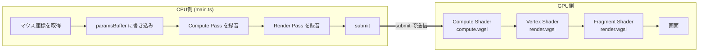
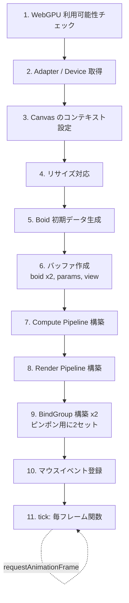
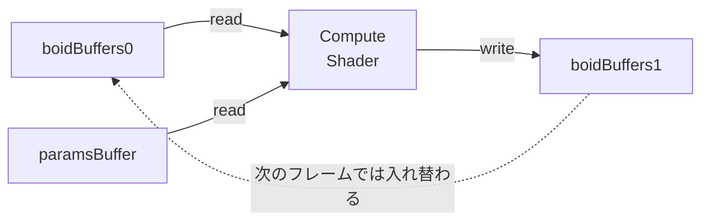

# 01. いま動いているもの

> このページの目標: `boids-webgpu/` に既にあるコードが、[00-webgpu-primer.md](./00-webgpu-primer.md) の概念をどう実装しているか、ファイル単位で読めるようになること。

## 現在の到達点

- 8000 羽（実体は三角形 1 個ずつ）が群行動則で動いている
- マウスで吸引・反発できる
- 速度に応じて色が変わる
- これは **2D**。Z 軸（高さ）はなく、上から見た平面世界

```
現在の見え方（イメージ）:

  ▲   ▲       ▲           ▲
       ▲    ▲      ▲   ▲
  ▲       ▲                ▲
       ▲           ▲    ▲
              ▲          ▲
   ▲    ▲          ▲
        ▲       ▲    ▲    ▲
              ▲

  全部、薄い三角形。ハトには見えない。3D ではなく真上視点。
```

## ファイルの全体図

```
boids-webgpu/
├── index.html              ← ブラウザが最初に読む HTML
├── package.json            ← npm の依存定義
├── tsconfig.json           ← TypeScript の設定
├── vite.config.ts          ← Vite（開発サーバ）の設定
└── src/
    ├── main.ts             ← TypeScript のエントリ。GPU の段取りはここ
    ├── style.css           ← HUD と背景の見た目
    └── shaders/
        ├── compute.wgsl    ← Boid の位置更新を並列計算するシェーダ
        └── render.wgsl     ← 鳥型を描く頂点+フラグメントシェーダ
```

## 役割を 1 行ずつで言うと

| ファイル | 何をしている | 命題 |
|----------|-----------|------|
| `index.html` | `<canvas>` を 1 枚置いて `main.ts` を読み込む | 入口 |
| `main.ts` | GPU の初期化、バッファ作成、毎フレームの命令送信 | 司令塔 |
| `compute.wgsl` | 「8000 羽の Boid の次の位置・速度を全員分同時に計算する」 | 行動則の頭脳 |
| `render.wgsl` | 「Boid の位置から三角形（鳥型）の頂点位置と色を決める」 | 描画 |
| `style.css` | HUD（fps 表示）と背景色 | 見た目 |

## 1 フレームのデータの流れ



## 各ファイルの中身（精読）

### `index.html`

```html
<canvas id="gpu"></canvas>
<div id="hud">...</div>
<script type="module" src="/src/main.ts"></script>
```

ポイント:
- `<canvas>` が描画先。WebGPU はこの canvas に対してレンダリングする
- HUD は CSS で右上に出している、純粋な HTML/CSS。GPU は触っていない
- `type="module"` で ES Modules として `main.ts` を読み込む（Vite がトランスパイル）

### `main.ts` の構造

ファイルを論理ブロックに分けるとこうなります。



#### 1〜2. Adapter / Device 取得

```ts
const adapter = await navigator.gpu.requestAdapter();
const device = await adapter.requestDevice();
```

- **Adapter**: 物理的な GPU の代理人（外付け GPU か内蔵 GPU か等を選ぶ）
- **Device**: 実際に命令を送る相手。バッファもパイプラインも全て `device` 経由で作る

#### 5. Boid 初期データ

各 Boid は 4 個の `f32` で表現します:

```
[ pos.x | pos.y | vel.x | vel.y ]   ← 16 バイト (4 floats)
```

これを 8000 個分、`Float32Array(8000 * 4)` に詰めて、ランダムな位置とランダム方向の初速で埋めます。

#### 6. バッファ作成（**ここが肝**）



- **ピンポンバッファ**: 同じバッファに「読み」と「書き」を同時にしてはいけない（古いデータと新しいデータが混在するため）。なので 2 個交互に使います。`boidBuffers[0]` を読みながら `boidBuffers[1]` に書き、次フレームは逆
- `paramsBuffer`: dt（経過時間）、マウス座標、行動則の係数を入れる小さな Uniform Buffer
- `viewBuffer`: 描画用にカメラの aspect、最大速度、時刻を入れる Uniform Buffer

#### 7. Compute Pipeline

```ts
const computePipeline = device.createComputePipeline({
  layout: "auto",
  compute: { module: ..., entryPoint: "cs_main" },
});
```

- `layout: "auto"`: BindGroupLayout を WGSL から自動推論する横着モード。手書きもできるがこの規模なら不要
- `entryPoint: "cs_main"`: WGSL の中の `@compute fn cs_main(...)` を呼ぶ

#### 11. tick: 毎フレーム関数

抽象化するとこんな構造です:

```ts
function tick() {
  // 1) パラメータを更新（dt, mouse, params, view）
  device.queue.writeBuffer(paramsBuffer, 0, params);
  device.queue.writeBuffer(viewBuffer, 0, view);

  // 2) コマンドを録音
  const enc = device.createCommandEncoder();
  {
    const pass = enc.beginComputePass();
    pass.setPipeline(computePipeline);
    pass.setBindGroup(0, computeBindGroups[frame % 2]);
    pass.dispatchWorkgroups(Math.ceil(NUM_BOIDS / 64));
    pass.end();
  }
  {
    const pass = enc.beginRenderPass({...});
    pass.setPipeline(renderPipeline);
    pass.setBindGroup(0, renderBindGroups[(frame + 1) % 2]);
    pass.draw(6, NUM_BOIDS);  // 6頂点 × 8000インスタンス
    pass.end();
  }

  // 3) GPU に送信
  device.queue.submit([enc.finish()]);

  frame++;
  requestAnimationFrame(tick);
}
```

ここを覚えれば WebGPU の毎フレームのリズムが掴めます。

### `compute.wgsl` の精読

責任: 「**ある瞬間の全 Boid の状態を読んで、次の瞬間の全 Boid の状態を書く**」

```wgsl
@compute @workgroup_size(64)
fn cs_main(@builtin(global_invocation_id) gid: vec3<u32>) {
  let i = gid.x;        // ← 自分は何番目の Boid か
  if (i >= n) { return; }
  let me = inBoids[i];  // 自分の現在状態を読む

  // 全 Boid を走査して群行動則を計算（O(N^2) ナイーブ実装）
  for (var j = 0u; j < n; j = j + 1u) {
    let other = inBoids[j];
    // 距離に応じて cohesion / alignment / separation を加算
    ...
  }

  // マウス力、速度クランプ、位置更新、トーラスラップ
  ...

  outBoids[i] = updated;  // 自分の次の状態を書く
}
```

`@workgroup_size(64)` は「64 個のコアを 1 グループとして起動」という指示です。`dispatchWorkgroups(125)` を呼ぶと `125 * 64 = 8000` 個のコアが起動して、それぞれが `gid.x = 0, 1, 2, ..., 7999` を担当します。

> 重要な性質: コア同士は基本的に**お互いを知らない**。「私の番号 = i、私の入力 = inBoids[i]、私の出力 = outBoids[i]」という独立した処理を 8000 個並べているだけ。だから並列に走らせても安全

### `render.wgsl` の精読

責任: 「**Boid の位置・速度から、画面上の三角形の頂点座標と色を決める**」

#### Vertex Shader (`vs_main`)

`draw(6, 8000)` で呼び出される:

- 第 1 引数 6: 頂点を 6 個分処理する（= 三角形 2 個 = 鳥型 1 羽）
- 第 2 引数 8000: それを 8000 インスタンス分繰り返す（= 8000 羽）

つまり Vertex Shader は **6 × 8000 = 48000 回**走ります。各呼び出しでは:

```wgsl
@builtin(vertex_index) vi: u32,      // 0..5 のどれか（鳥のどの頂点か）
@builtin(instance_index) ii: u32,    // 0..7999 のどれか（何羽目か）
```

を貰い、

1. `boids[ii]` から自分の所属する Boid の位置・速度を取得
2. 速度の方向 = 鳥の前方
3. `vi` に応じて、頭・左翼端・尾・右翼端の局所座標を選ぶ
4. 翼端は `sin(time * flapRate + ii * 0.137)` で羽ばたかせる
5. 局所座標を世界座標に変換 → NDC（クリップ空間）に変換 → 出力

#### Fragment Shader (`fs_main`)

ピクセルごとに呼ばれる。Vertex Shader が出した「速度」「羽ばたき位相」を使って、スレートグレー〜ダブグレーで色を決める。

## 既存コードの限界（PR で改善する点）

| 限界 | どこで顕在化 | どの PR で解消 |
|------|------------|---------------|
| 2D 平面でしか動かない | 高さ方向の変化なし、立体感なし | PR1 |
| 三角形 1 個でしかなく、ハトには見えない | render.wgsl が 6 頂点しか描かない | PR3〜4 |
| 翼の動きが擬似（位置の上下動だけ） | 本物のスケルタルアニメではない | PR4〜5 |
| O(N²) ナイーブ近傍探索 | 10000 体超で破綻する | （別 PR、今回はやらない） |

## ここまでで覚えてほしいこと

- `main.ts` は GPU の段取りをするコード。**バッファ作成 → パイプライン構築 → 毎フレーム命令送信**の 3 ブロック
- `compute.wgsl` は 1 個の Boid の更新ルールを書くだけで、それが 8000 個並列に走る
- `render.wgsl` は 1 羽の頂点と色を書くだけで、6 頂点 × 8000 インスタンス = 48000 回走る

次は [02-roadmap.md](./02-roadmap.md) で、3D ハトに到達するための 6 本の PR を確認します。
