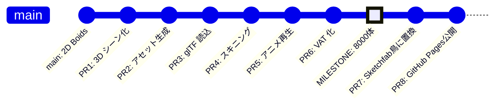
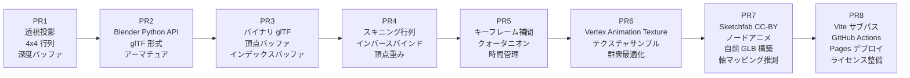

# 02. ロードマップ

> このページの目標: 「現在 → 最終形」までの距離を 6 本のコア PR + 拡張 PR に分割し、各 PR で何を学べばいいかを把握すること。

## 現在地と目的地

```
現在地（main ブランチ HEAD）              最終ゴール
────────────────────────                 ──────────────────
2D, 真上視点                          →  3D, 透視カメラ
鳥型シルエット 6 頂点                  →  ハトメッシュ 数百〜数千頂点
擬似的な翼の上下動                     →  本物のスケルタルアニメ
8000 体（fps 60）                     →  8000 体（fps 60 を維持）
```

## コア PR（PR1〜PR6）



### 一覧表

| # | PR タイトル | 主目的 | 主に触るファイル | 難易度 |
|---|-----------|-------|---------------|------|
| 1 | [3D シーンの足場](./pr/PR-01-3d-scene.md) | 2D を 3D に拡張、透視カメラ導入 | `main.ts`, `render.wgsl`, `compute.wgsl` | ★★ |
| 2 | [アセットパイプライン](./pr/PR-02-asset-pipeline.md) | Blender Python で `pigeon.glb` を生成 | `tools/make_pigeon.py`（新規） | ★★★ |
| 3 | [glTF ローダー](./pr/PR-03-gltf-loading.md) | `pigeon.glb` を WebGPU に読み込む | `src/gltf/`（新規）, `main.ts` | ★★★ |
| 4 | [スキニング](./pr/PR-04-skinning.md) | ボーン行列で頂点を変形 | `render.wgsl`, `main.ts` | ★★★★ |
| 5 | [アニメーション再生](./pr/PR-05-animation.md) | 時間に沿ってボーン行列を更新 | `src/animation/`, `main.ts` | ★★★ |
| 6 | [VAT で 8000 体](./pr/PR-06-vat.md) | アニメをテクスチャに焼き、ランタイム軽量化 | `tools/bake_vat.py`, `render.wgsl` | ★★★★ |
| 7 | [Sketchfab 鳥への置換](./pr/PR-07-sketchfab-bird.md) | 自家製ハトを Sketchfab の CC-BY モデルに置換 | `tools/bake_flying_bird.py`（新規）, `src/shaders/render.wgsl`, `src/gltf/loader.ts` | ★★★ |
| 8 | [GitHub Pages 公開](./pr/PR-08-github-pages.md) | サブパス対応、Actions ワークフロー、ライセンス整備 | `vite.config.ts`, `.github/workflows/deploy.yml`, `LICENSE` | ★★ |

> ⭐ `★` = 1 時間で読める。`★★★★` = 1 日かかる。だいたいの目安です

PR7・PR8 は「コア機能 (PR1〜PR6) を作り終えた後の拡張」です。コアの段階的な学習階段は PR6 で完結し、PR7 以降は外部アセット・公開作業など実務的なトピックを扱います。

## 学習の段階

各 PR で必ず通る「初登場の概念」を整理します。



## なぜこの順序か

**「動くものを早く、後から精度を上げる」** 戦略に従っています。

| 順序 | 理由 |
|-----|------|
| まず PR1（3D 化） | 2D のまま 3D メッシュを置いても見栄えしない。3D 空間を先に整える |
| 次に PR2（アセット） | コードより先にデータが要る。先に `pigeon.glb` を確保 |
| PR3 で読み込み | アニメより先に**静止画ハト 1 羽**を表示する。ここで失敗するとアニメどころではない |
| PR4 で曲げる | アニメ再生の前に「ボーンを手動で動かす」が動くことを確認する |
| PR5 で再生 | 既に曲がるなら、時間軸を入れるだけ |
| PR6 で量産 | アニメが 1 羽動いたら、最後に 8000 体に増やす |

> アンチパターン: 「最初から VAT で 8000 体実装」を狙うと、どこで詰まったか切り分けできなくなります。**1 羽が静止 → 1 羽が曲がる → 1 羽が動く → 8000 羽が動く** の階段を必ず守ること

## 各 PR のゴール（簡潔版）

詳細は各 PR ドキュメントへ。ここでは見出しだけ。

### PR1: 3D シーンの足場
**Done の定義**: 既存の鳥三角形が、傾けた透視カメラで 3D 空間に並んで見える

### PR2: アセットパイプライン
**Done の定義**: `pigeon.glb` がローカルに生成され、Blender でリグとアニメーションが確認できる

### PR3: glTF ローダー
**Done の定義**: 静止状態のハト 1 羽が、本来の T ポーズ（または bind pose）で画面中央に表示される

### PR4: スキニング
**Done の定義**: スライダーで翼の角度を変えると、ハトの翼が曲がる（時間連動はまだ）

### PR5: アニメーション再生
**Done の定義**: ハト 1 羽が、ループで自然に羽ばたき続ける

### PR6: VAT で 8000 体
**Done の定義**: 8000 羽が群行動則に従いながら羽ばたいて飛ぶ。fps 60 を維持

## 各 PR の git ブランチ運用（推奨）

```
main                     ← 既存 2D Boids（保護）
└── pr1-3d-scene
    └── pr2-asset-pipeline
        └── pr3-gltf-loader
            └── pr4-skinning
                └── pr5-animation
                    └── pr6-vat
```

各 PR ごとに:
1. 前の PR ブランチから派生
2. 機能完成
3. main にマージ（あるいは順次積む）
4. 次の PR ブランチを切る

> 1 人開発でブランチ運用が大袈裟に感じるかもしれませんが、**各段階で動く状態の git タグ**が残るのは、後で「どこで壊れたか」を切り分ける時に効きます

## 想定スケジュール

専業ではなく副業で進める前提:

| PR | 工数（実装のみ） | 工数（学習込み） |
|----|---------------|---------------|
| PR1 | 半日 | 1 日 |
| PR2 | 1 日 | 2 日 |
| PR3 | 1 日 | 2 日 |
| PR4 | 1 日 | 2 日 |
| PR5 | 半日 | 1 日 |
| PR6 | 1 日 | 2 日 |
| **合計** | **5 日** | **10 日** |

## ここまでで覚えてほしいこと

- 6 本の PR が 1 本ずつ「動くもの」を増やしていく
- 各 PR は「失敗しても 1 つ前に戻れる」サイズに切ってある
- 焦って飛ばすと、どこで壊れたか分からなくなる

次は最初の PR、[pr/PR-01-3d-scene.md](./pr/PR-01-3d-scene.md) です。
