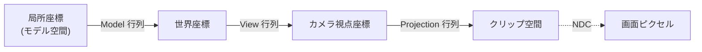
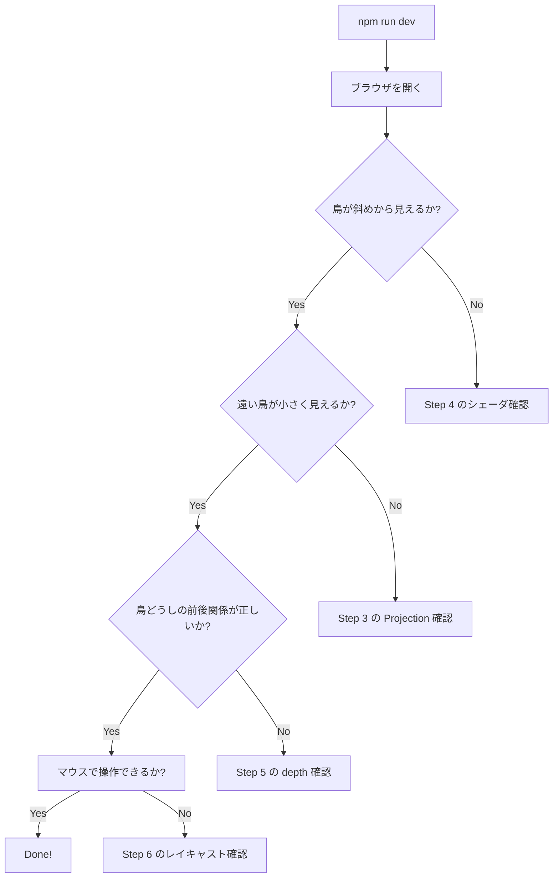

# PR1: 3D シーンの足場

> **Done の定義**: 既存の鳥型三角形が、**傾けた透視カメラ**で 3D 空間に並んで見える。マウスでの吸引・反発もそのまま動く

このページの目標: 2D の世界を 3D に拡張する仕組みを、初学者向けに噛み砕いて理解すること。

## なぜこれを最初にやるか

3D メッシュ（PR3 以降）を置く前に、3D 空間と透視カメラを用意しておかないと、「メッシュは正しいのに見栄えしない」のか「メッシュが間違っている」のか切り分けできません。先に**箱**を作っておきます。

## 完了後のイメージ

```
   現在 (2D 真上視点)              PR1 完了後 (3D 透視視点)
   ──────────────────              ────────────────────────

   ▲   ▲   ▲   ▲                       ▲ ✈
       ▲       ▲                ▲   ▲
   ▲       ▲                ▲     ▲ ✈
       ▲       ▲                ✈   ▲
                                  ▲     ✈

   全部同じ大きさ                    奥の鳥は小さく、手前は大きい
   z 座標なし                       z 座標が増え、立体的
```

## 前提知識（初登場の概念）

### 概念 1: 同次座標と 4x4 行列

3D グラフィクスでは、点 `(x, y, z)` を「**4 つ目の成分 w を足した** `(x, y, z, w)`」として扱います。これを **同次座標**（homogeneous coordinates）と呼びます。

なぜ 4 個目を足すのか:
- 3 次元の**回転と拡縮**は 3x3 行列で表せる
- でも**平行移動**（`x += 5` など）は 3x3 行列では表せない
- `w = 1` の 4 次元にすると、平行移動も含めて全部 4x4 行列の積で書ける

```
通常の点:    (x, y, z)        ← 3次元
同次座標:    (x, y, z, 1)     ← 4次元、最後の1は便宜上
方向ベクトル: (x, y, z, 0)    ← 平行移動の影響を受けない
```

このプロジェクトでは、**変換行列（transformation matrix）**として `mat4x4<f32>`（4×4 行列）を扱います。

### 概念 2: モデル / ビュー / プロジェクション

3D の点を画面ピクセルに対応させるまで、3 つの行列を順に掛けます。



| 行列 | 役割 | このプロジェクトでの中身 |
|------|------|---------------|
| **Model 行列** | 物体の位置・向き・大きさ | 各鳥の位置と向き |
| **View 行列** | カメラの位置・向き | 「カメラはこの場所から、ここを見ている」 |
| **Projection 行列** | カメラのレンズ（透視投影） | 視野角、近クリップ面、遠クリップ面 |

通常まとめて **MVP 行列** と呼びます: `MVP = Projection × View × Model`

> 行列の積は左から計算します（`v' = MVP * v`）。WGSL も同じ規則です

### 概念 3: 透視投影（perspective projection）

奥行きに応じて物が小さく見える投影方式です。

```
    視点         近クリップ面 (near)      遠クリップ面 (far)
     ●━━━━━━━━━━━━━━━━━━━━━━━━━━━━━━━━━━━━━━━━━━━━━━━━━
     │\                                                          
     │ \                                                         
     │  \                                                        
     │   ●━━━━ 視野角 (fov)                                       
     │  /                                                        
     │ /                                                         
     │/                                                          
     ●━━━━━━━━━━━━━━━━━━━━━━━━━━━━━━━━━━━━━━━━━━━━━━━━━
```

入力: 視野角（fov）、画面のアスペクト比、near、far
出力: 4x4 行列

WebGPU で使う標準の作り方は `gl-matrix` などのライブラリが提供しますが、依存を増やしたくないので、**今回は自前で 30 行程度の関数を書きます。**

### 概念 4: クリップ空間と NDC

Vertex Shader が出力する `@builtin(position)` は **クリップ空間** という特殊な 4 次元空間です。

GPU は受け取った値を `w` で割って **NDC**（Normalized Device Coordinates、正規化デバイス座標）にします。NDC は `-1 ≤ x, y ≤ 1`、`0 ≤ z ≤ 1`（WebGPU の場合）の立方体で、その中に入っているものだけが画面に映ります。

```
クリップ空間出力:    (cx, cy, cz, cw)
   ↓ GPU が自動的に w で割る
NDC:                (cx/cw, cy/cw, cz/cw)
   ↓ ビューポート変換
画面ピクセル:        (px, py)
```

このおかげで「奥のものは小さく」が自動的に実現されます: 奥にあるほど `cw` が大きくなる行列を Projection 行列が作るので、`cx/cw` は小さい数字になり、画面中央寄りに描画される ＝ 小さく見える、という仕組みです。

### 概念 5: 深度バッファ（Depth Buffer）

3D で奥行き順に正しく描画するための隠れた仕組みです。

```
   問題: 鳥 A が手前、鳥 B が奥にあるとき、
         描画順が「B → A」だと正しく見える（A が B を覆う）
         描画順が「A → B」だと B が前に描かれてしまう（バグ）

   解決: ピクセル単位で z 値を覚えておくバッファ（深度バッファ）を持つ
         新しいピクセルを描く前に「自分の z は今あるピクセルより手前か?」を
         自動チェック。手前ならだけ書き換える
```

WebGPU では `depthStencilAttachment` を render pass に追加し、`format: 'depth24plus'` のテクスチャを 1 枚作ります。

## 実装ステップ

### Step 1: シミュレーションを 3D 化

**変更ファイル**: `src/shaders/compute.wgsl`, `src/main.ts`

`Boid` 構造体を 2D → 3D に拡張:

```wgsl
// Before
struct Boid {
  pos: vec2<f32>,
  vel: vec2<f32>,
}

// After
struct Boid {
  pos: vec3<f32>,
  vel: vec3<f32>,
}
```

> ⚠️ メモリ詰めの注意: `vec3<f32>` は単独だと 12 バイトですが、配列内では 16 バイトに揃えられます（パディング 4 バイト）。Storage Buffer の構造体としては:
> ```wgsl
> struct Boid {
>   pos: vec3<f32>,
>   _pad0: f32,
>   vel: vec3<f32>,
>   _pad1: f32,
> }
> ```
> のように明示的にパディングを書くか、いっそ `vec4` で持つ（`pos.xyz` + 1 byte 余り）のが無難です。**今回は `vec4<f32>` で `xyz` を使う方針**を推奨

`bounds` も `vec3` に拡張。`y` を高度方向（[-0.4, +0.4] くらい）にし、`x, z` を平面方向にします。

### Step 2: カメラと行列を main.ts に追加

`mat4` ヘルパーを書きます（`src/lib/mat4.ts` を新設）:

- `perspective(fov, aspect, near, far)` → Projection 行列
- `lookAt(eye, target, up)` → View 行列
- `multiply(a, b)` → 行列積
- `identity()` → 単位行列

> 自前で書く理由: 依存を増やさないため、また「魔法の関数」ではなく中身を理解するため。約 60 行で足ります

### Step 3: View Uniform に MVP 行列を載せる

`viewBuffer` を拡張:

```ts
// Before: 16 bytes (aspect, maxSpeed, time, _pad)
// After: 80 bytes (mvp 4x4=64bytes, maxSpeed, time, _pad x2)
```

WGSL 側:

```wgsl
struct ViewUniform {
  mvp: mat4x4<f32>,
  maxSpeed: f32,
  time: f32,
  _pad: vec2<f32>,
}
```

### Step 4: Vertex Shader を 3D 化

```wgsl
// 鳥の局所座標（forward = +z, up = +y）
var local = vec3<f32>(0.0);
if (vi == 0u || vi == 3u) { local = vec3<f32>(0.0, 0.0,  1.0); }   // head
else if (vi == 1u)        { local = vec3<f32>(-1.0, 0.0, -0.6); }  // 左翼端
...

// boid の進行方向と上方向から回転行列を組む
let dir = normalize(b.vel);
let up  = vec3<f32>(0.0, 1.0, 0.0);
let right = normalize(cross(up, dir));
let realUp = cross(dir, right);

let world = b.pos + right * local.x + realUp * local.y + dir * local.z;

let clip = view.mvp * vec4<f32>(world, 1.0);
out.clip = clip;
```

### Step 5: 深度バッファを足す

```ts
const depthTexture = device.createTexture({
  size: [canvas.width, canvas.height],
  format: 'depth24plus',
  usage: GPUTextureUsage.RENDER_ATTACHMENT,
});
```

リサイズ時に再生成。`beginRenderPass` の `depthStencilAttachment` に渡す。
Render pipeline の `depthStencil: { format, depthWriteEnabled: true, depthCompare: 'less' }` も忘れずに。

### Step 6: マウス座標を 3D に投影

これまでマウス座標を 2D 平面の `(x, y)` として渡していました。3D 化後は「**カメラから出る光線が地面（y=0）と交わる点**」をマウス位置とします。これを **レイキャスト** と呼びます。

簡略版（ y=0 平面に対してのみ）:

```ts
// NDC のマウス座標 (mx, my, -1) を逆 MVP で世界座標に
// → カメラ位置とその点を結ぶ光線
// → y=0 と交わる点を t = -ray.origin.y / ray.dir.y で求める
```

PR1 の段階では複雑なら、当面はマウス座標を `(mouseX * aspect, 0, mouseY)` にマップする簡易版でも構いません。

## 検証方法



## 学べること

このPRを終えると、以下のことが言えるようになります:

- **3D グラフィクスの座標変換パイプライン**（モデル → ワールド → ビュー → クリップ → NDC）
- **同次座標と 4x4 行列**で平行移動・回転・拡縮を統一表現する利点
- **透視投影**の数学（中身を自分で書いた経験）
- **深度バッファ**がなぜ必要で、何を解決するか
- **WGSL の `mat4x4` と `vec3/vec4` の使い分け**

## 次の PR

[PR-02-asset-pipeline.md](./PR-02-asset-pipeline.md) — Blender Python でハトのモデルを生成します。
