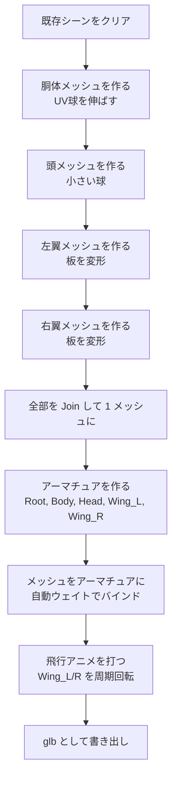
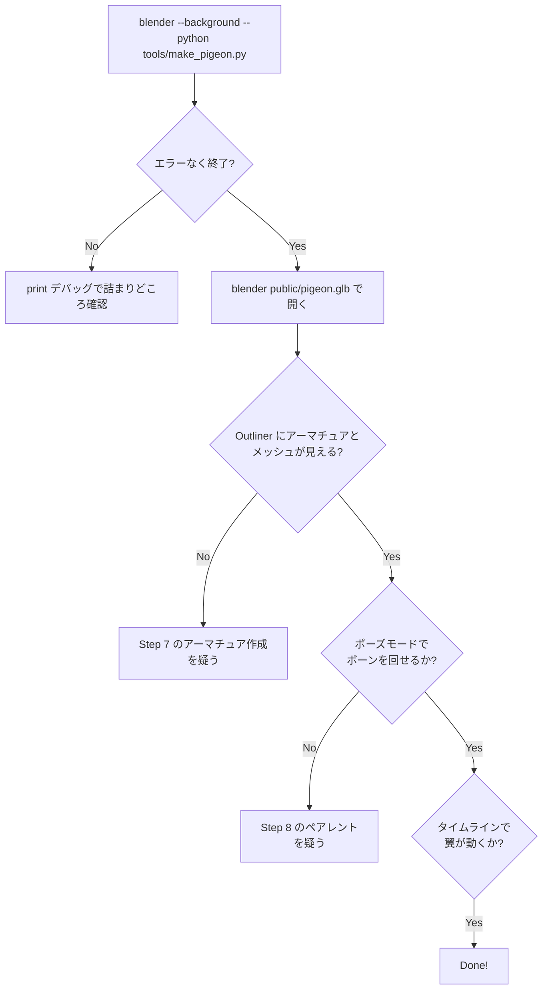

# PR2: アセットパイプライン（pigeon.glb の生成）

> **Done の定義**: `boids-webgpu/public/pigeon.glb` が生成され、Blender で開くと「翼が肩関節で曲がる、飛行アニメ付きのリグ済みハト」が確認できる

このページの目標: コードの世界からデータの世界へ一度出る。3D アセットの作り方と glTF が何かを学ぶ。

## なぜこれを次にやるか

3D メッシュを描画するコードを書くには、**まずメッシュが必要**です。コード側で `pigeon.glb` を空想しながら書き進めると、後で実際のデータと食い違って詰みます。先にデータを確定させます。

## 完了後の成果物

```
boids-webgpu/
├── public/
│   └── pigeon.glb          ← この PR の成果物
└── tools/                  ← 新規ディレクトリ
    └── make_pigeon.py      ← Blender Python スクリプト
```

`pigeon.glb` を Blender で開くと:

```
   Scene Outliner:
   ▾ Pigeon
     ▾ Armature
       ├─ Bone_Root
       │   ├─ Bone_Body
       │   ├─ Bone_Head
       │   ├─ Bone_Wing_L (←翼の根元、Z軸回転で羽ばたく)
       │   └─ Bone_Wing_R
     └─ Pigeon_Mesh (Body + Wings)

   Animation Editor:
   ▾ Action: "Flap"
     - Bone_Wing_L.rotation_euler.x  キーフレーム 4 個
     - Bone_Wing_R.rotation_euler.x  キーフレーム 4 個
```

## 前提知識（初登場の概念）

### 概念 1: glTF / GLB

**glTF**（GL Transmission Format）は 3D アセットの標準フォーマットです。「3D 業界の JPEG」と呼ばれることもあります。

| 形式 | 拡張子 | 中身 |
|------|--------|------|
| **glTF** | `.gltf` + 別ファイル | JSON + 別バイナリ + 別画像 |
| **GLB** | `.glb` | 全部 1 個のバイナリにまとめたもの |

このプロジェクトでは **GLB** を使います（1 ファイルで完結するため）。

GLB の中には以下が入ります:

```
pigeon.glb
├── JSON 部
│   ├── meshes: メッシュ定義（頂点バッファのどこを使うか）
│   ├── nodes: シーングラフ（親子関係）
│   ├── skins: スキン（ボーンと頂点重みの対応）
│   ├── animations: アニメーション（時間→ボーンの回転）
│   └── accessors / bufferViews: バイナリへの参照
└── バイナリ部
    ├── 頂点位置データ
    ├── 法線データ
    ├── 頂点重みデータ
    └── アニメーションキーフレームデータ
```

WebGPU 側では PR3 でこの構造をパースします。今のところは「Blender が出力する形式」と思ってください。

### 概念 2: アーマチュア（Armature）と ボーン（Bone）

**アーマチュア** = 骨格、**ボーン** = 骨。3D キャラクターを動かす標準手法です。

```
   ハトの骨格:

         ●Head
         │
   Wing_L●─●─●Wing_R
         │
         ●Body
         │
         ●Root
```

各ボーンには「親ボーン」があり、親が動くと子も連動して動きます。

ボーンには:
- **位置**（親ボーンからの相対位置）
- **回転**（クォータニオンまたはオイラー角）
- **スケール**

があります。アニメーションは「**時刻 t におけるボーンの回転値**」を時間軸上で定義したものです。

### 概念 3: 頂点とボーンの対応（スキニング）

各頂点は「**どのボーンの動きに連動するか**」を持ちます。

```
胴体の頂点:    Bone_Body に重み 1.0
翼の根元頂点: Bone_Body に重み 0.7、Bone_Wing_L に重み 0.3
翼の先頂点:    Bone_Wing_L に重み 1.0
```

これにより、`Bone_Wing_L` を回転させると、翼の頂点だけが追従して曲がります。

詳細は PR4 で扱います。今は「Blender が自動で重みを割り当てる」を信じて進めます。

### 概念 4: Blender Python API

Blender は内蔵 Python から完全に操作できます。`bpy` モジュール経由で:

```python
import bpy

# 立方体を作る
bpy.ops.mesh.primitive_cube_add()

# 選択物の名前を変える
bpy.context.object.name = "Pigeon_Body"

# モディファイアを追加
bpy.ops.object.modifier_add(type='SUBSURF')
```

スクリプトをコマンドラインから走らせるには:

```bash
blender --background --python make_pigeon.py
```

`--background` で UI なし、`--python` でスクリプト実行。**所要時間 5〜30 秒**。

## 実装ステップ

### Step 1: Blender がローカルにあるか確認

```bash
blender --version
```

なければ:

```bash
brew install --cask blender
```

### Step 2: `tools/make_pigeon.py` を書く

スクリプトの**論理ブロック**を先に整理しておきます。



スクリプトの骨子（実装は PR2 実装時に詰めます）:

```python
import bpy
import math
import os

OUT = os.path.abspath("../public/pigeon.glb")

# 1. シーンクリア
bpy.ops.wm.read_factory_settings(use_empty=True)

# 2. 胴体（楕円体）
bpy.ops.mesh.primitive_uv_sphere_add(segments=16, ring_count=8, radius=0.5)
body = bpy.context.object
body.name = "Body"
body.scale = (1.5, 0.6, 0.7)
bpy.ops.object.transform_apply(scale=True)

# 3. 頭
bpy.ops.mesh.primitive_uv_sphere_add(segments=12, ring_count=6, radius=0.3, location=(1.4, 0, 0.2))
bpy.context.object.name = "Head"

# 4. 左翼（薄い板を伸ばす）
bpy.ops.mesh.primitive_plane_add(size=1.0, location=(0, 0.6, 0))
left_wing = bpy.context.object
left_wing.name = "Wing_L"
left_wing.scale = (0.8, 1.4, 0.05)
left_wing.rotation_euler = (0, 0, math.radians(15))
bpy.ops.object.transform_apply(scale=True, rotation=True)

# 5. 右翼（左翼をミラー）
# ... 省略

# 6. Join
bpy.ops.object.select_all(action='DESELECT')
for obj_name in ["Body", "Head", "Wing_L", "Wing_R"]:
    bpy.data.objects[obj_name].select_set(True)
bpy.context.view_layer.objects.active = bpy.data.objects["Body"]
bpy.ops.object.join()
bpy.context.object.name = "Pigeon_Mesh"

# 7. アーマチュア作成
bpy.ops.object.armature_add(location=(0, 0, 0))
arm = bpy.context.object
arm.name = "Pigeon_Armature"
bpy.ops.object.mode_set(mode='EDIT')
# Root ボーンを編集 → Body, Head, Wing_L, Wing_R を子として追加
# (詳細は実装時)
bpy.ops.object.mode_set(mode='OBJECT')

# 8. メッシュをアーマチュアにペアレント（自動ウェイト）
mesh = bpy.data.objects["Pigeon_Mesh"]
mesh.select_set(True)
bpy.context.view_layer.objects.active = arm
bpy.ops.object.parent_set(type='ARMATURE_AUTO')

# 9. アニメーション（4 キーフレーム = 1 サイクル）
bpy.ops.object.mode_set(mode='POSE')
arm.animation_data_create()
arm.animation_data.action = bpy.data.actions.new(name="Flap")

# Wing_L のローカル X 軸回転を sine 波で打ち込む
# t=0:  -25 度（下）
# t=10: +35 度（上）
# t=20: -25 度（下）
# (Wing_R は対称)

# 10. 書き出し
bpy.ops.export_scene.gltf(
    filepath=OUT,
    export_format='GLB',
    export_animations=True,
    export_skins=True,
    export_apply=True,
)

print(f"Wrote {OUT}")
```

> 細部はプロのモデラーから見ると稚拙ですが、**「リグ付き 3D ハト」というデータが手に入る**最短経路です。後でクオリティを上げるのは別 PR で

### Step 3: 走らせる

```bash
cd tools/
blender --background --python make_pigeon.py
```

成功すると `public/pigeon.glb` が生成されます（リポジトリルート基準）。

### Step 4: 目視確認

```bash
blender ../public/pigeon.glb
```

- アウトライナーで Armature と Mesh が見える
- ボーン Wing_L を選択して R + X で回転 → 翼が曲がる
- タイムラインで Play → 翼が周期的に動く

### Step 5: コミットと .gitignore

`pigeon.glb` はバイナリで小さい（〜100KB）なので **git に入れる**。`tools/make_pigeon.py` も入れる。

`.gitignore` に Blender のバックアップを除外:

```
*.blend1
```

## 検証方法



## トラブルシュート

| 症状 | よくある原因 |
|------|------------|
| `bpy` が import できない | 通常の Python ではなく `blender --python` で実行する必要あり |
| ボーンを回しても翼が動かない | 自動ウェイトが効いていない。Vertex Group を手動で確認 |
| エクスポートしたら mesh が消えた | `transform_apply` を忘れて、scale が 0 のまま書き出された |
| GLB が大きすぎる | 球のセグメント数を減らす（`segments=16` → `12`） |

## 学べること

- **glTF / GLB** の役割と構造
- **アーマチュアとボーン** の基本概念
- **Blender Python API** の操作スタイル
- **自動ウェイト** で頂点をボーンにバインドする最短手順
- **キーフレームアニメーション** をスクリプトから打ち込む方法

## 次の PR

[PR-03-gltf-loading.md](./PR-03-gltf-loading.md) — 生成した `pigeon.glb` を WebGPU に読み込みます。
