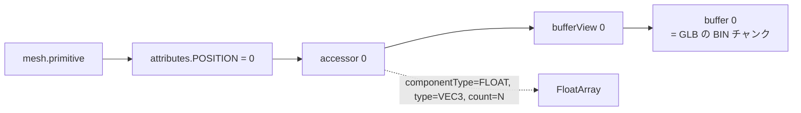
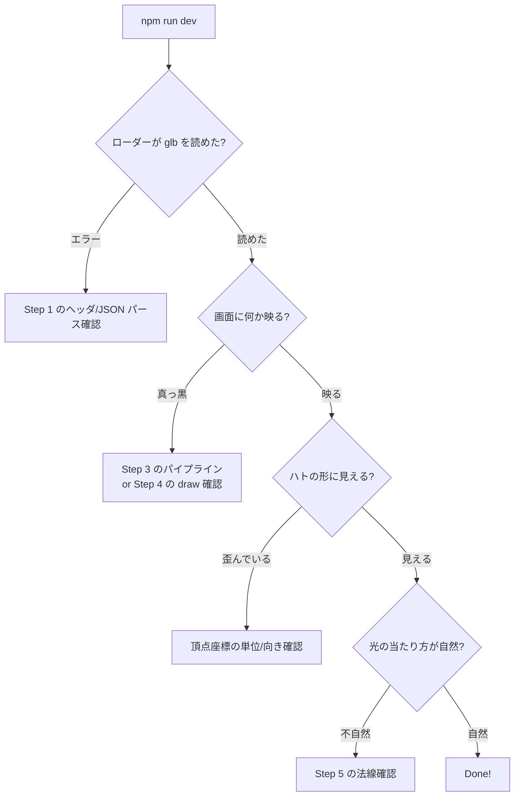

# PR3: glTF を WebGPU に読み込む

> **Done の定義**: ハト 1 羽が、bind pose（T ポーズ相当）の静止状態で画面中央に正しい大きさ・向きで表示される。**まだアニメは動かない。1 羽だけ。**

このページの目標: GLB バイナリをパースして、WebGPU の頂点バッファに載せ、メッシュとして描く。スキニングはまだ。

## なぜ「まず 1 羽・静止」か

- 8000 羽の前に、1 羽が正しく描けるか
- アニメの前に、bind pose が正しく描けるか

これを確認しないと、後で「どこで間違えたか」が分からなくなります。**動かないハト 1 羽**が今回のゴール。

## 前提知識（初登場の概念）

### 概念 1: GLB のバイナリ構造

```
GLB ファイルのバイト並び:
┌────────────────────────────────────────────┐
│ Header (12 bytes)                          │
│   magic = "glTF" (0x46546C67)              │
│   version = 2                              │
│   length = ファイル全体のバイト数            │
├────────────────────────────────────────────┤
│ Chunk 0: JSON                              │
│   length, type=0x4E4F534A ("JSON")         │
│   { meshes: [...], nodes: [...], ... }     │
├────────────────────────────────────────────┤
│ Chunk 1: BIN                               │
│   length, type=0x004E4942 ("BIN\0")        │
│   <頂点座標バイト列><法線バイト列>...        │
└────────────────────────────────────────────┘
```

JS でパースする最小コード（イメージ）:

```ts
const buffer = await (await fetch('/pigeon.glb')).arrayBuffer();
const view = new DataView(buffer);

const magic = view.getUint32(0, true);    // 0x46546C67 ('glTF')
const version = view.getUint32(4, true);  // 2
const length = view.getUint32(8, true);

const jsonChunkLength = view.getUint32(12, true);
const jsonChunkType = view.getUint32(16, true);  // 0x4E4F534A
const jsonBytes = new Uint8Array(buffer, 20, jsonChunkLength);
const json = JSON.parse(new TextDecoder().decode(jsonBytes));

const binOffset = 20 + jsonChunkLength;
const binLength = view.getUint32(binOffset, true);
const binData = new Uint8Array(buffer, binOffset + 8, binLength);
```

### 概念 2: glTF の参照構造（accessor / bufferView）

頂点データは「**バイナリのどこからどう読むか**」を JSON が指示する仕組みです。



主な属性（attribute）:

| 属性 | 意味 | 型 |
|------|------|-----|
| `POSITION` | 頂点座標 | `VEC3` (`f32` × 3) |
| `NORMAL` | 法線 | `VEC3` (`f32` × 3) |
| `TEXCOORD_0` | UV 座標 | `VEC2` (`f32` × 2) |
| `JOINTS_0` | 影響を受けるボーン番号（4 個） | `VEC4` (`u8` または `u16` × 4) |
| `WEIGHTS_0` | ボーン重み（4 個） | `VEC4` (`f32` × 4) |

### 概念 3: 頂点バッファとインデックスバッファ

**頂点バッファ**: 頂点ごとの属性データ（位置、法線、UV、ボーン重み等）の生並び

**インデックスバッファ**: 三角形を構成する頂点番号の並び

```
頂点バッファ:    [頂点0, 頂点1, 頂点2, 頂点3, ...]
インデックスバッファ: [0, 1, 2,  2, 1, 3,  ...]
                    ↑ 三角形 1   ↑ 三角形 2
```

インデックスバッファを使うと、共有頂点の重複を避けられます。**典型的に頂点数の 3〜10 倍の三角形を、頂点を増やさず作れる**。

### 概念 4: 1 羽の Model 行列

PR1 で 8000 羽を「位置 + 速度」から自動配置していました。今回は**ハト 1 羽だけ画面中央に置く**ので、Model 行列を `identity()`（単位行列）にして「世界座標 = 局所座標」とします。後で 8000 羽に戻すときは PR1 の仕組みに置き直します。

## 実装ステップ

### Step 1: glTF ローダーを書く

**変更ファイル**: `src/gltf/loader.ts`（新規）

ライブラリは使いません。最小実装で:

- GLB ヘッダーをパース → JSON と BIN を切り出す
- `gltf.meshes[0].primitives[0]` を取り出す（このプロジェクトはハト 1 メッシュ前提）
- `attributes.POSITION` の accessor から `Float32Array` を作る
- 同じく `NORMAL`, `JOINTS_0`, `WEIGHTS_0` を取り出す
- `indices` から `Uint16Array` または `Uint32Array` を作る
- `skins[0]` から bind pose のボーン情報も取り出しておく（PR4 で使う）

> 注意: glTF には数百のオプションフィールドがあります。**今回は自前ハトしか読まない**ので、必要なフィールドだけ対応すれば十分。フル glTF パーサにしないこと

戻り値:

```ts
type Mesh = {
  positions: Float32Array;  // 頂点座標 (vec3 × N)
  normals: Float32Array;    // 法線 (vec3 × N)
  joints: Uint8Array;       // 影響ボーン番号 (vec4 × N)
  weights: Float32Array;    // ボーン重み (vec4 × N)
  indices: Uint16Array;     // 三角形インデックス (uint16 × M*3)
  vertexCount: number;
  triangleCount: number;
};

type Skeleton = {
  joints: Joint[];          // ボーン配列
  inverseBindMatrices: Float32Array; // インバースバインド行列 × ボーン数 (PR4 で使う)
};
```

### Step 2: WebGPU バッファに転送

**変更ファイル**: `src/main.ts`

```ts
const mesh = await loadGLB('/pigeon.glb');

// 頂点バッファ: position(vec3) + normal(vec3) を 1 個の interleaved バッファに
const stride = (3 + 3) * 4; // 24 bytes
const interleaved = new Float32Array(mesh.vertexCount * 6);
for (let i = 0; i < mesh.vertexCount; i++) {
  interleaved.set(mesh.positions.subarray(i * 3, i * 3 + 3), i * 6);
  interleaved.set(mesh.normals.subarray(i * 3, i * 3 + 3), i * 6 + 3);
}
const vertexBuffer = device.createBuffer({
  size: interleaved.byteLength,
  usage: GPUBufferUsage.VERTEX | GPUBufferUsage.COPY_DST,
});
device.queue.writeBuffer(vertexBuffer, 0, interleaved);

const indexBuffer = device.createBuffer({
  size: mesh.indices.byteLength,
  usage: GPUBufferUsage.INDEX | GPUBufferUsage.COPY_DST,
});
device.queue.writeBuffer(indexBuffer, 0, mesh.indices);
```

> Interleaved（属性をインターリーブ）にする理由: GPU のメモリアクセス効率。POSITION と NORMAL を同じバッファに混ぜると、1 頂点のデータが連続して並び、キャッシュヒット率が上がる

### Step 3: Render Pipeline を書き直す

**変更ファイル**: `src/shaders/render.wgsl`, `src/main.ts`

これまで「procedural な 6 頂点」だった頂点供給を、**頂点バッファから読む**方式に切り替えます。

```ts
const renderPipeline = device.createRenderPipeline({
  layout: 'auto',
  vertex: {
    module: ...,
    entryPoint: 'vs_main',
    buffers: [
      {
        arrayStride: 24,  // 6 floats
        attributes: [
          { shaderLocation: 0, offset: 0, format: 'float32x3' },  // position
          { shaderLocation: 1, offset: 12, format: 'float32x3' }, // normal
        ],
      },
    ],
  },
  ...
});
```

WGSL 側:

```wgsl
@vertex
fn vs_main(
  @location(0) position: vec3<f32>,
  @location(1) normal: vec3<f32>,
) -> VSOut {
  let world = position;  // PR3 ではモデル行列を単位行列にする
  let clip = view.mvp * vec4<f32>(world, 1.0);
  // ...
}
```

### Step 4: 描画コール

```ts
pass.setPipeline(renderPipeline);
pass.setBindGroup(0, viewBindGroup);
pass.setVertexBuffer(0, vertexBuffer);
pass.setIndexBuffer(indexBuffer, 'uint16');
pass.drawIndexed(mesh.indices.length);  // 1羽だけ
```

> 注意: `drawIndexed` は「インデックスバッファを使った描画」。`draw` と違い、頂点を共有できる

### Step 5: 簡単な照明

法線が描画できるようになったら、**ランバート照明**で立体感を付けます:

```wgsl
let lightDir = normalize(vec3<f32>(0.3, 1.0, 0.5));
let diffuse = max(dot(in.normal, lightDir), 0.0);
let color = pigeonGray * (0.3 + 0.7 * diffuse);
```

ハトのグレーが、光の当たる側で明るく、反対側で暗く見えれば 3D らしい立体感が出ます。

## 検証方法



## トラブルシュート

| 症状 | よくある原因 |
|------|------------|
| 画面が真っ黒 | バインドグループが間違っている／クリップ空間に出てない |
| ハトが裏返って見える | カリング設定（`primitive.cullMode`）が `back` で内側を向いている |
| ハトが巨大すぎる/小さすぎる | Blender 側のスケール、または PR1 の Projection の near/far/fov |
| 三角形がガタガタ | インデックスバッファの型（uint16 vs uint32）と createBuffer の usage が合っていない |
| 法線が変 | glTF の `NORMAL` ではなく Blender 側でフラットシェーディング設定になっている |

## 学べること

- **GLB のバイナリレイアウト**を自分でパースした経験
- **頂点バッファとインデックスバッファ**の使い分け
- **Vertex Buffer Layout**（`shaderLocation`, `offset`, `format`）
- **インターリーブ vs プラナー**な頂点データ配置
- **法線とランバート照明**で 3D の立体感を出す基本

## 次の PR

[PR-04-skinning.md](./PR-04-skinning.md) — ボーンを使って翼を曲げます。
