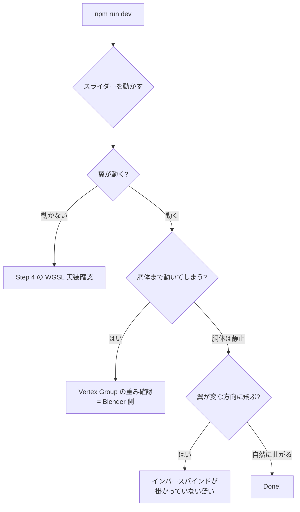

# PR4: スキニング（ボーンで翼を曲げる）

> **Done の定義**: スライダー（または時刻に依らない手動値）で `Wing_L` の回転角を変えると、ハトの翼の頂点だけが曲がる。胴体は動かない。**まだアニメは時間連動しない。**

このページの目標: 頂点シェーダで「ボーン行列 × 頂点位置」のスキニング計算を実装する。

## なぜ手動スライダーでまずやるか

時間軸（PR5）と量（PR6）の前に、**「ボーンが動けば対応する頂点が動く」が確実に動いている**ことを確認しないと、後でデバッグできません。

## 前提知識（初登場の概念）

### 概念 1: スキニングの数学

各頂点には:

- **元の位置** `P` (bind pose、つまり静止時の位置)
- **影響を受けるボーン番号** `j[0], j[1], j[2], j[3]` (最大 4 個)
- **対応する重み** `w[0], w[1], w[2], w[3]` (合計 1.0)

がついていて、ボーン `i` の現在の変換行列を `M[i]` とすると:

```
変形後の位置 P' = Σ w[k] * M[j[k]] * P  (k = 0, 1, 2, 3)
```

> 重み `w[k]` は浮動小数。0 の頂点 (= 影響なし) も含めて 4 個記録するのが標準

### 概念 2: インバースバインド行列

**罠**: 上の式の `M[i]` は「**ボーンが bind pose からどれだけ動いたか**」を表す行列です。Blender が出力する各ボーンの現在の世界座標行列をそのまま使うと、bind pose の段階で頂点が変な位置に飛ぶことがあります。

そこで:

```
M[i] = (現在のボーンの世界座標行列) × (インバースバインド行列[i])
                                       ↑ 最初に1回計算しておく定数
```

**インバースバインド行列**は「**bind pose 時のボーンの世界座標の逆行列**」で、glTF の `skin.inverseBindMatrices` に最初から入っています。

直感的に言うと:
1. 頂点 P を、まずボーンのローカル座標系に持っていく（インバースバインド を掛ける）
2. 次に、現在のボーンの世界座標系に戻す（現在の世界行列を掛ける）

bind pose のときは「世界 × 逆世界 = 単位行列」になり、頂点は動かない（== 正しい）。動かしたボーンだけ頂点が追従する。

### 概念 3: Storage Buffer でボーン行列を渡す

ボーンが 5〜30 個あり、それぞれ `mat4x4<f32>`（64 bytes）。Uniform Buffer の制限（〜64KB）には収まりますが、**Storage Buffer** で渡すのが今後の拡張性的に楽です（PR6 で 8000 体分のボーンを並べる時にそのまま使えるため）。

```wgsl
@group(0) @binding(2) var<storage, read> jointMatrices: array<mat4x4<f32>>;
```

### 概念 4: WGSL のベクトル/行列演算

```wgsl
let vec4_pos = vec4<f32>(position, 1.0);          // vec3 → vec4
let transformed = jointMatrices[3] * vec4_pos;    // 行列 × ベクトル
let blended = m1 * 0.7 + m2 * 0.3;                // 行列のスカラー和
```

行列の積は左から作用します。`A * B * v` は「v に B を作用させてから A を作用させる」。

## 実装ステップ

### Step 1: 頂点バッファに JOINTS と WEIGHTS を追加

**変更ファイル**: `src/main.ts`

PR3 で `position` + `normal` だった頂点バッファに、`joints` (uint8 × 4) と `weights` (f32 × 4) を追加します:

```
1 頂点 = 16 bytes
  position: vec3<f32>  (12 bytes)
  normal:   vec3<f32>  (12 bytes)  ← 24 bytes
  joints:   vec4<u8>   (4 bytes)   ← 28 bytes
  weights:  vec4<f32>  (16 bytes)  ← 44 bytes
                                   ↑ 4 byte align のため余白 4 入れて 48 bytes
```

実用上は **48 bytes / 頂点** で揃えるとアラインメントが楽です。

```ts
buffers: [{
  arrayStride: 48,
  attributes: [
    { shaderLocation: 0, offset: 0, format: 'float32x3' },   // position
    { shaderLocation: 1, offset: 12, format: 'float32x3' },  // normal
    { shaderLocation: 2, offset: 24, format: 'uint8x4' },    // joints
    { shaderLocation: 3, offset: 32, format: 'float32x4' },  // weights
  ],
}],
```

### Step 2: ボーン行列バッファを作る

```ts
const jointCount = skeleton.joints.length;
const jointBuffer = device.createBuffer({
  size: jointCount * 64,  // mat4x4 = 64 bytes
  usage: GPUBufferUsage.STORAGE | GPUBufferUsage.COPY_DST,
});
```

### Step 3: 毎フレーム、ボーン行列を計算してアップロード

```ts
function computeJointMatrices(skeleton, wingAngle) {
  const matrices = new Float32Array(jointCount * 16);

  for (let i = 0; i < jointCount; i++) {
    const joint = skeleton.joints[i];

    // 1. ボーンのローカル変換 (TRS) を作る
    let local = trs(joint.translation, joint.rotation, joint.scale);

    // 2. Wing_L / Wing_R には追加で X 軸回転を掛ける
    if (joint.name === 'Wing_L') {
      local = multiply(local, rotationX(wingAngle));
    } else if (joint.name === 'Wing_R') {
      local = multiply(local, rotationX(-wingAngle));  // 対称
    }

    // 3. 親の世界行列と掛けて自分の世界行列を作る
    const parent = joint.parentIdx >= 0 ? worldMatrices[joint.parentIdx] : identity();
    const world = multiply(parent, local);
    worldMatrices[i] = world;

    // 4. 最後にインバースバインドを掛けて、シェーダ用の行列にする
    const skinMat = multiply(world, skeleton.inverseBindMatrices[i]);
    matrices.set(skinMat, i * 16);
  }

  device.queue.writeBuffer(jointBuffer, 0, matrices);
}
```

> 注意: ボーン配列はトポロジカルソートされている前提（親が常に子より前）。glTF はそうでないこともあるので、ローダーで親→子順に並べ直す処理が要ります

### Step 4: スキニングを WGSL に書く

```wgsl
@group(0) @binding(2) var<storage, read> jointMatrices: array<mat4x4<f32>>;

@vertex
fn vs_main(
  @location(0) position: vec3<f32>,
  @location(1) normal: vec3<f32>,
  @location(2) joints: vec4<u32>,
  @location(3) weights: vec4<f32>,
) -> VSOut {
  let p = vec4<f32>(position, 1.0);
  let n = vec4<f32>(normal, 0.0);

  // 4 個のボーンの影響をブレンド
  let m =
    jointMatrices[joints.x] * weights.x +
    jointMatrices[joints.y] * weights.y +
    jointMatrices[joints.z] * weights.z +
    jointMatrices[joints.w] * weights.w;

  let skinnedPos = m * p;
  let skinnedNorm = m * n;

  let clip = view.mvp * skinnedPos;
  // ...
}
```

> ⚠️ `uint8x4` を WGSL で受け取ると `vec4<u32>` になります（u8 を u32 に拡張される）

### Step 5: 手動スライダーで翼角度を変える

`index.html` に `<input type="range">` を追加して、`wingAngle` を 0〜90 度の範囲で動かせるようにします。

```html
<input id="wing" type="range" min="-30" max="60" value="0" />
```

```ts
const wingSlider = document.getElementById('wing') as HTMLInputElement;
let wingAngle = 0;
wingSlider.addEventListener('input', () => {
  wingAngle = parseFloat(wingSlider.value) * Math.PI / 180;
});
```

毎フレーム `computeJointMatrices(skeleton, wingAngle)` を呼ぶ。

## 検証方法



## トラブルシュート

| 症状 | よくある原因 |
|------|------------|
| 全頂点が原点に集中する | `weights` の合計が 1.0 になっていない（正規化漏れ） |
| 翼が異常な方向に飛ぶ | インバースバインド行列が掛かっていない or 順番が逆 |
| ボーンを 1 個動かすと全部動く | 親子関係が glTF と違う（ローダーのバグ） |
| 法線が逆向きになる | スキニング行列で法線にも `m * n` を掛けるべきところを単位行列で扱った |
| `uint8x4` で受けても 0 しか入らない | バッファに書き込む時に Uint8Array でなく Float32Array で詰めてしまった |

## 学べること

- **スキニングの数学** (Σ w[k] * M[j[k]] * P) を自分で実装した経験
- **インバースバインド行列** が必要な理由
- **ボーンの世界行列を親子伝播で計算**する標準パターン
- **Storage Buffer で行列配列を渡す**設計
- **WGSL の `vec4<u32>`** 経由でインデックスを扱う

## 次の PR

[PR-05-animation.md](./PR-05-animation.md) — スライダーの代わりに時間で翼を動かします。
