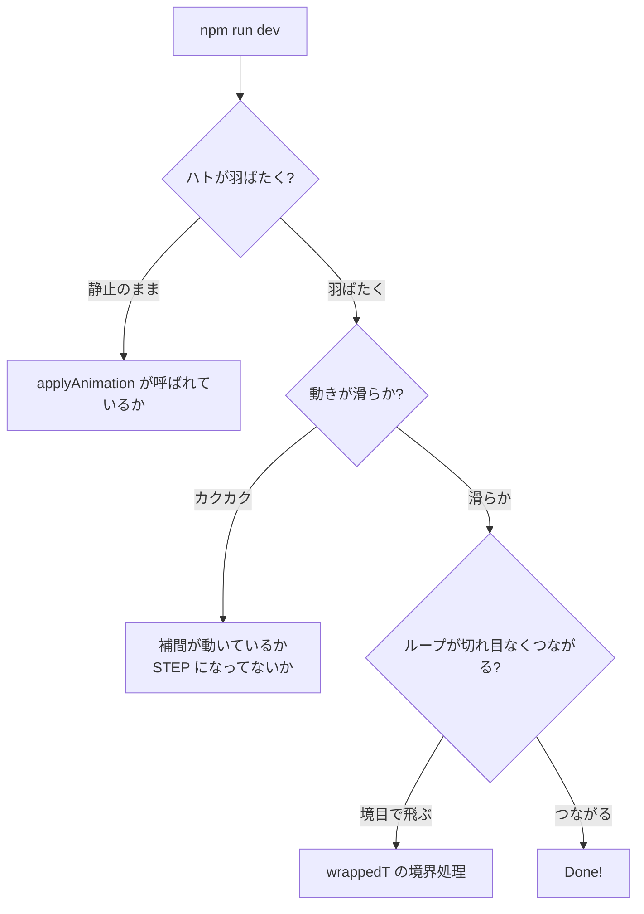

# PR5: アニメーション再生

> **Done の定義**: ハト 1 羽が、glTF に焼き込まれた飛行アニメーションをループで再生し続ける。スライダーは消す（または "play/pause" 切り替えに変える）

このページの目標: 時間軸に沿ってボーン行列を計算し、自然な羽ばたきを再生する。

## 前提知識

### 概念 1: glTF アニメーションの構造

```
animation: {
  channels: [             # ボーンごとに1つずつ並ぶ
    {
      target: { node: 4, path: "rotation" },   # Bone_Wing_L の回転
      sampler: 0,
    },
    ...
  ],
  samplers: [
    {
      input: 5,         # 時刻配列の accessor (vec1<f32>)
      output: 6,        # 値の配列 accessor (vec4<f32> for rotation)
      interpolation: "LINEAR",
    },
    ...
  ],
}
```

| キー | 意味 |
|------|------|
| `target.node` | どのボーンを動かすか |
| `target.path` | 何を動かすか (`translation` / `rotation` / `scale`) |
| `sampler.input` | キーフレームの**時刻**配列 (`[0.0, 0.1, 0.2, 0.3, ...]`) |
| `sampler.output` | キーフレームの**値**配列。`rotation` ならクォータニオン |
| `sampler.interpolation` | 補間方式: `LINEAR` / `STEP` / `CUBICSPLINE` |

### 概念 2: クォータニオン（quaternion）

3D 回転を表現する 4 要素 `(x, y, z, w)`。glTF は回転を必ずクォータニオンで持ちます。

オイラー角 (X-Y-Z 軸回転) は計算が簡単ですが、**ジンバルロック**（軸が重なって自由度を失う）があります。クォータニオンは:

- ジンバルロックがない
- 補間（slerp）が滑らか
- 1 個の値で 3 軸の回転を表現

線形補間（lerp）でも実用上 OK ですが、正規化を忘れずに:

```ts
function quatLerp(a, b, t) {
  return normalize([
    a[0] * (1 - t) + b[0] * t,
    a[1] * (1 - t) + b[1] * t,
    a[2] * (1 - t) + b[2] * t,
    a[3] * (1 - t) + b[3] * t,
  ]);
}
```

> 厳密には slerp（球面線形補間）の方が一様ですが、隣接キーフレームの差が大きくない限り lerp で十分。ハトの羽ばたきはこれで OK

### 概念 3: クォータニオンから回転行列に変換

```
q = (x, y, z, w)
R = | 1-2(y²+z²)    2(xy-zw)     2(xz+yw)    0 |
    | 2(xy+zw)      1-2(x²+z²)   2(yz-xw)    0 |
    | 2(xz-yw)      2(yz+xw)     1-2(x²+y²)  0 |
    | 0             0            0           1 |
```

これは標準公式なので、自前 `mat4` ライブラリに `fromQuat(q)` として実装。

## 実装ステップ

### Step 1: glTF ローダーをアニメーション対応に拡張

**変更ファイル**: `src/gltf/loader.ts`

```ts
type AnimationChannel = {
  jointIndex: number;
  path: 'translation' | 'rotation' | 'scale';
  times: Float32Array;       // [0.0, 0.05, 0.1, ...]
  values: Float32Array;      // 値の連結 (rotation なら 4 個ずつ)
};

type Animation = {
  name: string;
  duration: number;
  channels: AnimationChannel[];
};
```

PR3 で読まなかった `gltf.animations` を解凍します。

### Step 2: 時刻に対するボーン状態の評価

**新規**: `src/animation/sampler.ts`

```ts
function sampleChannel(channel: AnimationChannel, t: number): number[] {
  // t が channel.times のどの 2 点の間にあるか二分探索 or 線形探索
  const i = findInterval(channel.times, t);
  const t0 = channel.times[i];
  const t1 = channel.times[i + 1];
  const u = (t - t0) / (t1 - t0);

  const stride = channel.path === 'rotation' ? 4 : 3;
  const v0 = channel.values.subarray(i * stride, i * stride + stride);
  const v1 = channel.values.subarray((i + 1) * stride, (i + 1) * stride + stride);

  if (channel.path === 'rotation') {
    return quatLerp(v0, v1, u);
  } else {
    return vec3Lerp(v0, v1, u);
  }
}
```

### Step 3: 毎フレーム、現在時刻からボーンの TRS を更新

```ts
function applyAnimation(skeleton, animation, t) {
  const wrappedT = t % animation.duration;
  for (const channel of animation.channels) {
    const value = sampleChannel(channel, wrappedT);
    const joint = skeleton.joints[channel.jointIndex];
    if (channel.path === 'rotation') joint.rotation = value;
    else if (channel.path === 'translation') joint.translation = value;
    else if (channel.path === 'scale') joint.scale = value;
  }
}
```

### Step 4: ボーンの世界行列計算は PR4 のものを流用

PR4 で書いた `computeJointMatrices` を、`wingAngle` 受け取る版から「**boneの TRS を毎フレーム再評価する**」版に切り替えます:

```ts
function computeJointMatrices(skeleton) {
  for (let i = 0; i < skeleton.joints.length; i++) {
    const joint = skeleton.joints[i];

    // 現在の TRS から local 行列を作る
    const local = composeTRS(joint.translation, joint.rotation, joint.scale);

    // 親と合成
    const parent = joint.parentIdx >= 0 ? worldMatrices[joint.parentIdx] : IDENTITY;
    worldMatrices[i] = multiply(parent, local);

    // インバースバインドを掛けてスキニング用行列を作る
    const skinMat = multiply(worldMatrices[i], skeleton.inverseBindMatrices[i]);
    jointMatricesData.set(skinMat, i * 16);
  }
  device.queue.writeBuffer(jointBuffer, 0, jointMatricesData);
}
```

### Step 5: メインループで時間を流す

```ts
function tick() {
  const now = performance.now();
  const elapsed = (now - startT) / 1000;

  applyAnimation(skeleton, animation, elapsed);
  computeJointMatrices(skeleton);

  // ... 既存の描画
}
```

### Step 6: スライダーを撤去 or 切り替え

`index.html` のスライダーを削除。デバッグ目的に「Pause」ボタンだけ残しても良い。

## 検証方法



## トラブルシュート

| 症状 | よくある原因 |
|------|------------|
| ハトが羽ばたかない | アニメーション JSON をパースしていない、または `applyAnimation` が呼ばれていない |
| 動きが速すぎる/遅すぎる | `t` の単位（秒 vs ミリ秒）と `times` の単位が合っていない |
| 翼が爆発する | クォータニオンを正規化していない（lerp 後に長さが 1 でなくなっている） |
| 動きが反転する | クォータニオン補間で「短い回転 vs 長い回転」を区別していない（dot < 0 のとき片方を反転する処理が抜けている） |

## 学べること

- **glTF アニメーションのデータ構造** とパース方法
- **クォータニオン**の意味と線形補間の仕方
- **回転行列とクォータニオンの相互変換**
- **時間軸に沿ってボーン行列を再計算**するメインループの構造
- **アニメーションのループ**処理（modulo）

## 次の PR

[PR-06-vat.md](./PR-06-vat.md) — 8000 体に増やすために、アニメをテクスチャに焼きます。
