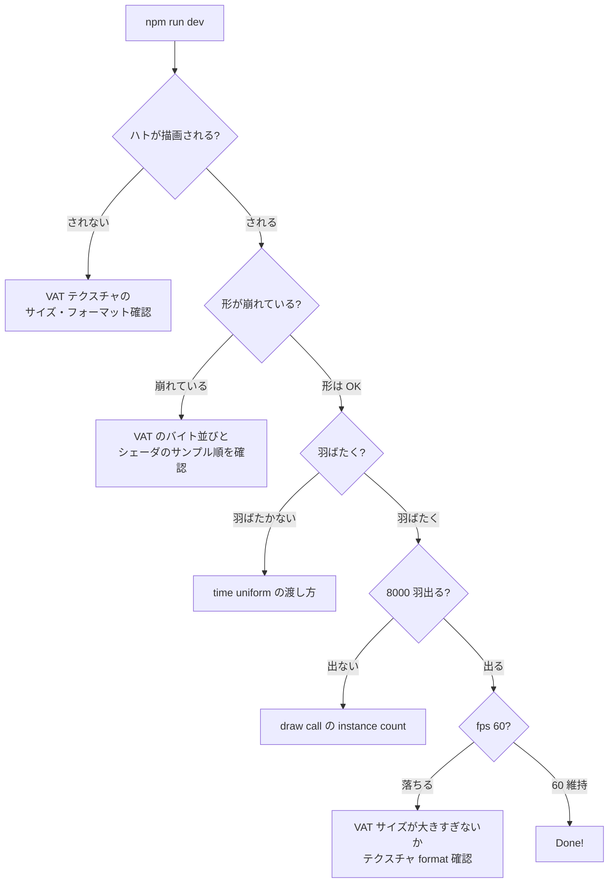

# PR6: VAT（Vertex Animation Texture）で 8000 体

> **Done の定義**: 8000 羽のハトが、それぞれ少しずつ位相をずらしながら羽ばたきつつ、群行動則で飛ぶ。fps 60 を維持

このページの目標: 1 羽動かしただけのアニメを、8000 体並列に動かすための「**焼き込み**」を理解し実装する。

## なぜスキニングのまま 8000 体にしないか

PR5 までの仕組みのまま 8000 体に拡張すると、毎フレーム CPU で:

```
8000 体 × 30 ボーン × 64 byte = 約 15 MB
```

を計算してアップロードすることになります。アップロード帯域だけで 15MB × 60fps = 900 MB/s。**現実的ではありません**。

### CPU 負荷の比較

```
スキニング方式:                       VAT 方式:
─────────────────────                ──────────────
8000 体ぶん:                          全インスタンス共通:
  各ボーンの TRS 評価                   ・1 回だけテクスチャ準備（起動時）
  各ボーンの世界行列計算
  インバースバインド乗算               ランタイムで CPU が触るのは:
  Storage Buffer に書込                 ・「現在時刻」を view buffer に書く
                                        ・以上、終わり
   ↓ 帯域
  900 MB/s
                                       ↓ 帯域
                                       ほぼゼロ
```

## 前提知識（初登場の概念）

### 概念 1: VAT（Vertex Animation Texture）の発想

**核心**: アニメーションの結果（= 各時刻における各頂点の最終位置）を**事前計算してテクスチャに焼く**。

```
通常のスキニング:
   毎フレーム、各頂点で
   [W = Σ w[k] * M[j[k]]] を計算 ← 重い

VAT:
   起動時に 1 回だけ、
   [全頂点 × 全時刻] のスキニング後の位置を計算 → テクスチャに保存
   ランタイムでは「テクスチャをサンプル」するだけ ← 軽い
```

### 概念 2: テクスチャを 2D 配列として使う

VAT はテクスチャだが、**ピクセルではなく数値の配列**として扱います。

```
テクスチャ:
    縦: フレーム番号 (0 〜 31)         ← アニメーションの時間軸
    横: 頂点番号 (0 〜 vertexCount-1)  ← どの頂点か

  各テクセルの中身:
    R = position.x
    G = position.y
    B = position.z
    A = (空き、または法線情報を圧縮)
```

```
   時刻t=0   ▒▒▒▒▒▒▒▒▒▒▒▒▒▒▒▒▒▒▒▒▒▒  ← bind pose の頂点位置
   時刻t=1   ▒▒▒▒▒▒▒▒▒▒▒▒▒▒▒▒▒▒▒▒▒▒  ← 翼少し上がった
   時刻t=2   ▒▒▒▒▒▒▒▒▒▒▒▒▒▒▒▒▒▒▒▒▒▒
   時刻t=3   ▒▒▒▒▒▒▒▒▒▒▒▒▒▒▒▒▒▒▒▒▒▒
   ...
   時刻t=31  ▒▒▒▒▒▒▒▒▒▒▒▒▒▒▒▒▒▒▒▒▒▒
            ↑ 1 頂点                   ↑ 別の 1 頂点
```

### 概念 3: フォーマットの選択

| フォーマット | bit/ch | サイズ | 精度 |
|------------|-------|------|------|
| `rgba8unorm` | 8 | 4 byte | 0〜1 の範囲を 256 段階 |
| `rgba16float` | 16 | 8 byte | 浮動小数 (推奨) |
| `rgba32float` | 32 | 16 byte | フル精度 |

`rgba16float` が**サイズと精度のバランスで標準**。1024 頂点 × 32 フレーム × 8 byte = 256 KB で済みます。

ただし WebGPU で float テクスチャを直接サンプリングするには、`features: ['float32-filterable']` か `rgba16float` のフィルタリング対応を adapter から有効化する必要があります（環境依存）。

### 概念 4: VAT のサンプリング

頂点シェーダで:

```wgsl
@vertex
fn vs_main(
  @builtin(vertex_index) vid: u32,
  @builtin(instance_index) iid: u32,
) -> VSOut {
  // インスタンスごとの羽ばたき位相
  let phaseOffset = f32(iid) * 0.137;
  let phase = view.time * flapRate + phaseOffset;

  // 0.0 〜 1.0 に正規化
  let normT = fract(phase / animDuration);

  // フレーム数 (0 〜 31) に変換
  let frameF = normT * f32(NUM_FRAMES);

  // 補間用に 2 フレームをサンプル
  let f0 = u32(floor(frameF));
  let f1 = (f0 + 1u) % u32(NUM_FRAMES);
  let alpha = fract(frameF);

  let pos0 = textureLoad(vatTexture, vec2<u32>(vid, f0), 0).xyz;
  let pos1 = textureLoad(vatTexture, vec2<u32>(vid, f1), 0).xyz;
  let pos = mix(pos0, pos1, alpha);

  // ... モデル行列適用、MVP 変換
}
```

## 実装ステップ

### Step 1: Blender Python で VAT を焼く

**変更ファイル**: `tools/bake_vat.py`（新規）

```python
import bpy, struct, os, sys

NUM_FRAMES = 32
START_FRAME = 1
END_FRAME = 32
OUT_BIN = "../public/pigeon_vat.bin"

bpy.ops.wm.open_mainfile(filepath="pigeon.blend")  # PR2 の途中で .blend を保存しておく

mesh_obj = bpy.data.objects["Pigeon_Mesh"]
arm_obj = bpy.data.objects["Pigeon_Armature"]

# 評価済みメッシュの頂点数
deps = bpy.context.evaluated_depsgraph_get()
eval_obj = mesh_obj.evaluated_get(deps)
vert_count = len(eval_obj.data.vertices)

# 出力バッファ: NUM_FRAMES x vert_count x 4 (RGBA float16)
import numpy as np
data = np.zeros((NUM_FRAMES, vert_count, 4), dtype=np.float16)

for f_idx in range(NUM_FRAMES):
    bpy.context.scene.frame_set(START_FRAME + f_idx)
    deps = bpy.context.evaluated_depsgraph_get()
    eval_obj = mesh_obj.evaluated_get(deps)
    me = eval_obj.data
    for v_idx, v in enumerate(me.vertices):
        co = v.co
        data[f_idx, v_idx, 0] = co.x
        data[f_idx, v_idx, 1] = co.y
        data[f_idx, v_idx, 2] = co.z
        data[f_idx, v_idx, 3] = 0.0

with open(OUT_BIN, 'wb') as f:
    f.write(data.tobytes())

print(f"Wrote {OUT_BIN}: {NUM_FRAMES} frames x {vert_count} verts")
```

実行:

```bash
blender --background --python tools/bake_vat.py
```

### Step 2: WebGPU で VAT テクスチャを作成

**変更ファイル**: `src/main.ts`

```ts
// 1. バイナリを fetch
const vatBuffer = await (await fetch('/pigeon_vat.bin')).arrayBuffer();

// 2. テクスチャ作成
const vatTexture = device.createTexture({
  size: [vertexCount, NUM_FRAMES, 1],
  format: 'rgba16float',
  usage: GPUTextureUsage.TEXTURE_BINDING | GPUTextureUsage.COPY_DST,
});

// 3. アップロード
device.queue.writeTexture(
  { texture: vatTexture },
  vatBuffer,
  { bytesPerRow: vertexCount * 8 },  // 4 channels x 2 bytes (float16)
  { width: vertexCount, height: NUM_FRAMES, depthOrArrayLayers: 1 },
);
```

### Step 3: シェーダから VAT をサンプリング

PR4-5 のスキニング部分を**全削除**し、VAT サンプリングに置き換えます:

```wgsl
@group(0) @binding(2) var vatTexture: texture_2d<f32>;
// (sampler は textureLoad なら不要)

@vertex
fn vs_main(
  @builtin(vertex_index) vid: u32,
  @builtin(instance_index) iid: u32,
) -> VSOut {
  // ... 上の概念4のコード
  let pos = vatLookup(vid, iid);
  // ...
}
```

> 注意: `joints` と `weights` 属性はもう使わないので、頂点バッファから削除して頂点サイズを縮められる

### Step 4: 8000 インスタンスに戻す

PR3 で 1 羽だけ描画するために `drawIndexed(numIndices)` にしていたのを、`drawIndexed(numIndices, NUM_BOIDS)` に戻す。

そして PR1 で書いた「Boid の位置と速度から Model 行列を作る」ロジックを再びシェーダに入れる:

```wgsl
@vertex
fn vs_main(
  @builtin(vertex_index) vid: u32,
  @builtin(instance_index) iid: u32,
) -> VSOut {
  // 1. VAT から自分のフレームの頂点位置をサンプル
  let localPos = vatLookup(vid, iid);

  // 2. boid の位置と速度から、その鳥の Model 行列を作る
  let b = boids[iid];
  let dir = normalize(b.vel);
  let up  = vec3<f32>(0.0, 1.0, 0.0);
  let right = normalize(cross(up, dir));
  let realUp = cross(dir, right);

  let world = b.pos + right * localPos.x + realUp * localPos.y + dir * localPos.z;

  // 3. MVP で画面座標へ
  out.clip = view.mvp * vec4<f32>(world, 1.0);
  // ...
}
```

### Step 5: 法線も VAT に焼く（任意）

法線も時間で変わるので、もう 1 枚テクスチャを焼くと**ライティングが正しく**なります。あるいは「法線は近似でいい」と割り切って、頂点バッファの bind-pose 法線をそのまま使う手もあります（多少不自然だが小さい鳥では気付きにくい）。

## 検証方法



## トラブルシュート

| 症状 | よくある原因 |
|------|------------|
| 真っ黒 | VAT テクスチャを bind group に渡し忘れ、または `textureLoad` の座標がはみ出している |
| 形が爆発 | フレーム間補間で隣接フレームの頂点番号がずれている、またはバイト順 little/big endian 問題 |
| アニメが速すぎる/遅すぎる | `view.time` を `animDuration` で割っていない、または NUM_FRAMES の値の食い違い |
| ライティングがおかしい | bind-pose の法線をそのまま使っているのを忘れている。許容するか、normal VAT を追加 |
| メモリエラー | VAT が `rgba32float` で巨大化。`rgba16float` に変える |

## 学べること

- **VAT という群衆最適化手法** の発想
- **テクスチャを「ピクセル」ではなく「数値の表」として使う**思考
- **Blender Python から評価済みメッシュ** を取り出す方法
- **GPU の帯域とテクスチャ format** のトレードオフ
- **「時間軸を 0〜1 に正規化してテクスチャ Y 軸にマップ」** という汎用パターン

## 完了後の状態

🎉 **ゴール達成です。**

- 8000 羽のハトが、それぞれ違う位相で羽ばたきながら
- 群行動則で集まったり離れたり
- マウスで誘導でき
- fps 60 を維持

```
                ハト  ✈   ✈   ハト
            ハト    ✈   ✈    ハト
        ハト    ✈    ✈    ハト
            ✈    ✈    ✈
        ハト   ✈   ✈   ハト
                ✈   ✈
```

## 次のステップ（オプション）

- **影**: 地面に楕円の影を落とす（もう 1 枚 quad を VAT サンプル位置で描く）
- **空間ハッシュ**: 群行動則の O(N²) を改善して 100k 羽に挑む
- **ハトの色のバリエーション**: インスタンスごとにグレーの濃淡を散らす
- **HDR スカイドーム**: 背景を空にする
- **正規ハトモデル**: 自前ハトを Sketchfab の本物リグ付きハトに置き換える

ここまでお疲れ様でした。
