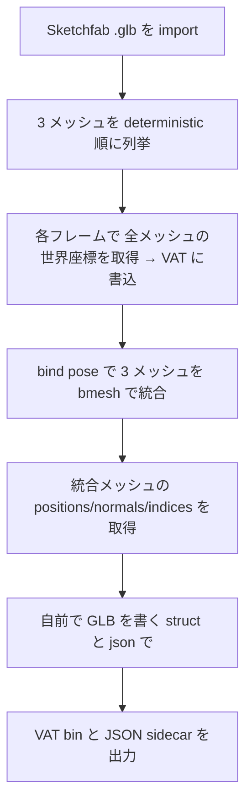
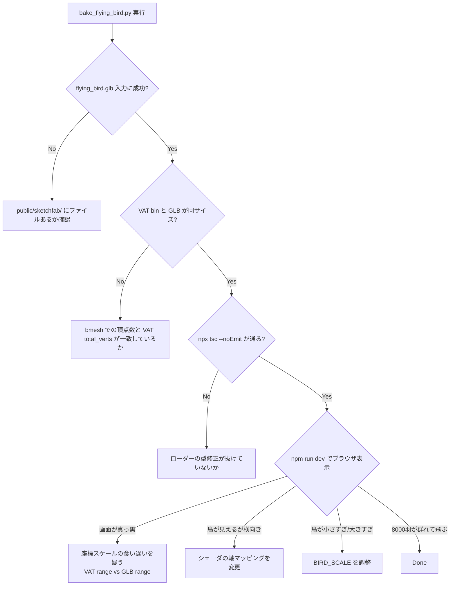

# PR7: 自家製ハトを Sketchfab の鳥モデルに置き換え

> **Done の定義**: Sketchfab の "Flying Bird" by sandeep.s（CC-BY 4.0）を取り込み、8000 羽の鳥が群れて羽ばたく。HUD と README に CC-BY クレジットが表示される。fps 60 を維持

このページの目標: 外部の 3D アセットを取り込むパイプラインを理解し、Blender 経由のアセット統合で踏み抜きやすい罠とその回避方法を学ぶこと。

## なぜこの PR をやるか

PR2 で自家製した「楕円体 + 球 + 板」のハトは、技術検証（リギング・スキニング・VAT）としては十分でしたが、見た目が「ハトに似た何か」止まりでした。実物のアーティストが作ったモデルに置き換えると以下の利点があります:

1. **見栄えの大幅向上** — リアルな鳥のシルエットと飛行モーション
2. **外部アセットパイプラインの確立** — Sketchfab → Blender → VAT → WebGPU の流れを一度通せば、別の鳥モデルにも応用できる
3. **ライセンス順守の実例** — CC-BY 4.0 は何をしなければならないかを実装で覚える

ただし、外部アセットの統合は **予期しない罠が複数あります**。本 PR では順番に解説し、なぜ最終的に「Blender の glTF エクスポータを使わずに自前で GLB を書く」という選択になったかを記録します。

## 完了後のイメージ

```
   現在 (PR6: 自家製ハト)               PR7 完了後 (Sketchfab の鳥)
   ──────────────────                  ─────────────────────────────

   小さな三角形組合せが羽ばたく            滑らかな鳥のシルエットが羽ばたく
   ハトに見えるが、シルエットが固い        飛行モーションも生き物らしい

   HUD: fps / boids                    HUD: fps / boids / Pause
                                       右下: Bird model: "Flying Bird" 
                                              by sandeep.s, CC-BY 4.0
```

## 前提知識（初登場の概念）

### 概念 1: Sketchfab と CC-BY 4.0

**Sketchfab** は 3D モデル共有プラットフォームです。多くのモデルが Creative Commons ライセンス下で配布されています。

**CC-BY 4.0**（Creative Commons Attribution 4.0 International）は次の使い方を認めるライセンスです:

| 行為 | 許可? | 条件 |
|------|------|------|
| 商用利用 | ✅ | 表示義務あり |
| 改変 | ✅ | 表示義務あり、改変の旨を明記 |
| 再配布 | ✅ | 表示義務あり |
| 派生作品 | ✅ | 表示義務あり |

**表示義務（attribution）に必要な情報**:
1. 著作者名
2. 作品の URL
3. ライセンス名と URL
4. 改変したか否か

これを README やアプリ内（HUD など）に明記します。

> ⚠️ 「Free」と書かれていても CC-BY-NC（非商用）や CC-BY-SA（同一ライセンスでの再配布）など、より厳しい条件のものもあります。**ダウンロード前に必ずライセンスを確認してください**。

### 概念 2: ノードアニメーション vs スケルタルアニメーション

3D モデルのアニメーション方式には大きく 2 種類あります。

```
スケルタルアニメーション (PR4 で実装したもの):

    ┌─Mesh (1 個)
    └─Armature
        └─Bone1
            └─Bone2 ← 回転キーフレーム
                └─Bone3

    アニメーションは「ボーンの回転キーフレーム」として記録される。
    各頂点はボーン重み付けで変形する。


ノードアニメーション (今回の Sketchfab 鳥):

    ┌─Mesh1 (Body)         ← 位置キーフレーム
    ├─Mesh2 (Wing_L)        ← 回転キーフレーム
    └─Mesh3 (Wing_R)        ← 回転キーフレーム

    アニメーションは「メッシュオブジェクト全体の TRS キーフレーム」として記録される。
    メッシュは剛体として動く（変形しない）。
```

| 観点 | スケルタル | ノード |
|------|-----------|------|
| 実装の手間（オーサリング側） | 高（ボーン配置・ウェイトペイント） | 低（オブジェクトを動かすだけ） |
| 実装の手間（ランタイム側） | 高（ボーン行列計算・スキニング） | 低（オブジェクト位置を時刻で参照） |
| 表現力 | 高（曲げる・捻る） | 低（剛体のみ） |
| メッシュ数 | 1 個 | 複数個 |
| `inspect_glb.py` での見え方 | `bone_count` ≥ 1 | `bone_count` = 0、`mesh_count` > 1 |

**今回の Flying Bird は完全にノードアニメーション方式**です。3 個のメッシュ（Body / Wing_L / Wing_R）が独立した `rotation_euler` キーフレームで動きます。

### 概念 3: VAT は両方式に対応できる

ありがたいことに、**VAT は元のアニメーション方式を問わず使えます**。なぜなら:

```
VAT に焼くのは「アニメーション結果としての頂点世界座標」だけ
   ↓
ボーン → 頂点重み付け の連鎖計算結果も
ノード → 全頂点に同じ rigid transform を適用 した結果も
   ↓
最終的に「各頂点の世界座標」として表せる
   ↓
VAT[frame, vertex_id] にその座標を書き込めば良い
```

つまり PR6 の VAT パイプラインは、ボーンなしモデルでも**そのまま使える**ことになります。

ただし**全メッシュを単一の頂点列に統合する**処理が必要です（VAT は 1 個の `vertex_index` 軸を持つテクスチャなので、3 メッシュが別々の vid 空間を持っていると扱えない）。

### 概念 4: Blender の glTF エクスポータが行う暗黙の変換

ここが今回の **最大の罠** です。

Blender の `bpy.ops.export_scene.gltf()` は、エクスポート時に以下の処理を**暗黙に**適用します:

| 処理 | 内容 |
|------|------|
| 軸変換 | Blender (Z-up, +Y forward) → glTF (Y-up, -Z forward) |
| 単位スケール | scene の `unit_settings` を反映、Maya の cm モデルが ~100 倍の値で出力されることがある |
| 頂点分裂 | UV シーム・法線ハードエッジで頂点を複製（POSITION 数 != 元のメッシュ頂点数） |
| 法線再計算 | 平均化やフラット化を独自に行う |

ドキュメント化されているとは言え、**最終 GLB の数値が Blender world coords とは一致しない**点に注意。

VAT を `wm @ v.co`（Blender 内部の world coords）から焼いてしまうと、エクスポート後の GLB と**スケールも軸も合わなくなります**。

### 概念 5: 自前で GLB を書く

GLB は次の単純なバイナリ形式です:

```
┌──────────────────────────────────┐
│ Header (12 bytes)                │
│   magic = 0x46546C67 ("glTF")    │
│   version = 2                    │
│   length = 全体長                  │
├──────────────────────────────────┤
│ JSON chunk                       │
│   header (8 bytes): length, type │
│   payload: glTF JSON 本体          │
├──────────────────────────────────┤
│ BIN chunk                        │
│   header (8 bytes): length, type │
│   payload: バイナリデータ            │
└──────────────────────────────────┘
```

JSON にはアクセサ・バッファビュー・メッシュ等の参照構造、BIN には頂点・インデックスの数値が入ります。

**Python の `struct.pack` と `json.dumps` だけで生成可能**で、依存ライブラリは不要です。100 行ほど書けば最小限の GLB が出力できます。

これにより、Blender エクスポータの「暗黙の変換」を完全にバイパスして、VAT と bit-identical な座標を持つ静的 GLB を作れます。

### 概念 6: 頂点軸マッピングの推測

ダウンロードしたモデルの「forward 方向」がどの軸かは、メーカーごとに違います:

| ツール | デフォルト forward | デフォルト up |
|--------|-------------------|------------|
| Maya | +Z | +Y |
| 3ds Max | +Y | +Z |
| Unity | +Z | +Y |
| Unreal | +X | +Z |
| Blender | -Y（+Y forward 設定もあり） | +Z |
| glTF spec | -Z | +Y |

VAT のデータレンジを観察することで推測できます:

```
今回の Flying Bird の VAT 範囲:
  x: ±0.25      (~0.5 単位、左右対称)
  y: -0.28..+0.16 (~0.45 単位、下に偏り)
  z: -0.02..+0.26 (~0.3 単位、すべて非負)

推論:
  x が左右対称 → 左右の翼端 → 「右」軸
  y が下に偏り → 足元が深く、頭は浅い → 「上」軸
  z がすべて非負 → 原点から頭方向への奥行き → 「前」軸

結論: モデル軸は (右, 上, 前) = (+x, +y, +z)
```

これは Maya のデフォルト規約と一致しており、Sketchfab の Maya 出力モデルとして矛盾しない。

## 実装ステップ

### Step 1: モデルの選定と入手

**変更ファイル**: `public/sketchfab/flying_bird.glb`（新規）

1. Sketchfab で目的のモデルを探す。今回は ["Flying Bird" by sandeep.s](https://sketchfab.com/3d-models/flying-bird-eb843194e06d429ebef7dd4aa7e265c1)
2. ライセンスを確認 — CC-BY 4.0 ✅
3. アニメ付きであることを確認 ✅
4. ダウンロード（要 Sketchfab アカウント）
5. **glTF Binary (.glb) 形式**を選ぶ（単一ファイルで完結）
6. `public/sketchfab/flying_bird.glb` に配置

> 💡 ZIP（glTF + scene.bin + テクスチャ）を選ぶと複数ファイル管理になるため避ける

### Step 2: アセット構造の調査

**変更ファイル**: なし（既存の `tools/inspect_glb.py` を使う）

```bash
/Applications/Blender.app/Contents/MacOS/Blender --background \
  --python tools/inspect_glb.py -- public/sketchfab/flying_bird.glb
```

**確認すべき項目**:
- メッシュ数（1 か複数か）
- ボーンの有無（armature_count）
- アニメーションの有無
- 頂点数の概数
- アニメーション名と長さ

> 今回の出力例:
> ```
> glb_meshes       : 3
> glb_skins        : 0
> armature_count   : 0
> bone_count       : 0
> glb_animations   : 1
> action: name='Take 001' fcurves=11
> ```
> → ノードアニメ方式・3 メッシュ・armature なし、と判明

### Step 3: bake スクリプトの設計

**変更ファイル**: `tools/bake_flying_bird.py`（新規）

スクリプトの責任を 3 段階で分けます:



#### 3.1 メッシュの deterministic 順序付け

メッシュの統合順序が変わると `vertex_index` と VAT 行の対応が崩れます。**名前順で固定**する:

```python
mesh_objs = sorted(
    [obj for obj in bpy.data.objects if obj.type == "MESH"],
    key=lambda o: o.name,
)
```

#### 3.2 VAT への焼き込み

Blender 内部の world coords を直接読みます:

```python
for f_idx, frame_num in enumerate(frame_samples):
    scene.frame_set(frame_num)
    deps = bpy.context.evaluated_depsgraph_get()
    v_offset = 0
    for obj in mesh_objs:
        eval_obj = obj.evaluated_get(deps)
        wm = eval_obj.matrix_world
        for i, v in enumerate(eval_obj.data.vertices):
            world_co = wm @ v.co
            data[f_idx, v_offset + i, 0:3] = (world_co.x, world_co.y, world_co.z)
        v_offset += len(eval_obj.data.vertices)
```

これで `data[frame, vertex_id, xyz]` に座標が入ります。

#### 3.3 統合メッシュ（bmesh）

bmesh は Blender の低レベルメッシュ編集 API で、頂点・面の追加順序を完全に制御できます:

```python
import bmesh
bm = bmesh.new()
bm_verts = []

for obj in mesh_objs:
    eval_obj = obj.evaluated_get(deps)
    for i in range(len(eval_obj.data.vertices)):
        # 頂点座標は VAT[0] から取る → VAT と GLB で完全一致
        x = float(data[0, len(bm_verts), 0])
        y = float(data[0, len(bm_verts), 1])
        z = float(data[0, len(bm_verts), 2])
        bm_verts.append(bm.verts.new((x, y, z)))

# 各メッシュの面を vertex offset 付きで追加
for obj_idx, obj in enumerate(mesh_objs):
    offset = v_offset_per_obj[obj_idx]
    for poly in obj.data.polygons:
        bm.faces.new([bm_verts[offset + i] for i in poly.vertices])

bmesh.ops.triangulate(bm, faces=bm.faces[:])  # 四角形を三角形に
```

#### 3.4 自前 GLB 書き出し

`bpy.ops.export_scene.gltf()` は使いません（座標変換を入れられるため）。代わりに `struct.pack` で組む:

```python
def build_glb_minimal(positions, normals, indices) -> bytes:
    pos_bytes = positions.astype(np.float32).tobytes()
    nrm_bytes = normals.astype(np.float32).tobytes()
    idx_bytes = indices.astype(np.uint16).tobytes()
    # ... padding to 4-byte boundaries

    gltf_json = {
        "asset": {"version": "2.0"},
        "scene": 0,
        "scenes": [{"nodes": [0]}],
        "nodes": [{"mesh": 0}],
        "meshes": [{
            "primitives": [{
                "attributes": {"POSITION": 0, "NORMAL": 1},
                "indices": 2,
                "mode": 4,
            }],
        }],
        "buffers": [{"byteLength": ...}],
        "bufferViews": [...],
        "accessors": [...],
    }

    # 12-byte header + JSON chunk + BIN chunk として組立
    out = struct.pack("<III", 0x46546C67, 2, total_len)
    out += struct.pack("<II", json_chunk_len, 0x4E4F534A)
    out += json_bytes
    out += struct.pack("<II", bin_chunk_len, 0x004E4942)
    out += bin_data
    return out
```

これで **VAT[0] と GLB の POSITION が bit-identical** になります。

### Step 4: シェーダの軸マッピング

**変更ファイル**: `src/shaders/render.wgsl`

VAT 範囲から推定した軸マッピングを反映:

```wgsl
// before (自家製ハト = +X forward 想定)
forward * localPos.x + right * localPos.y + realUp * localPos.z

// after (Sketchfab Flying Bird = +X right, +Y up, +Z forward)
right * localPos.x + realUp * localPos.y + forward * localPos.z
```

bind-pose 法線も同様に再マッピング。

### Step 5: スケール定数の調整

VAT 範囲が ~0.5 単位なので、画面に映るサイズを ~0.075 単位に揃える:

```wgsl
// before
const PIGEON_SCALE: f32 = 0.04;   // 自家製ハトは ~1 unit だった

// after
const BIRD_SCALE: f32 = 0.15;     // Sketchfab 鳥は ~0.5 unit
```

**最終的な鳥サイズ** = 0.5 × 0.15 = 0.075 sim 単位。シーンの半幅が ~1 単位なので、8000 羽が個別に視認できる。

### Step 6: ローダーの寛容化

**変更ファイル**: `src/gltf/loader.ts`

PR3〜PR4 で書いたローダーは `JOINTS_0` / `WEIGHTS_0` を必須としていましたが、ノードアニメモデルにはありません。**任意属性**に変更:

```ts
// before
if (jntIdx === undefined) throw new Error("JOINTS_0 missing");
if (wgtIdx === undefined) throw new Error("WEIGHTS_0 missing");

// after
const joints = jntIdx !== undefined ? readJoints(...) : new Uint8Array(vertexCount * 4);
const weights = wgtIdx !== undefined ? readFloat32(...) : new Float32Array(vertexCount * 4);
```

VAT パイプラインではこれらを参照しないため、ゼロ充填でダウンストリームの型整合だけ保てば OK。

### Step 7: ライセンス表記

**変更ファイル**: `index.html`, `src/style.css`, `README.md`

#### HUD の右下にクレジット表示

```html
<div id="credit">
  Bird model: <a href="...">"Flying Bird"</a> by sandeep.s, 
  licensed <a href="...">CC-BY 4.0</a>.
</div>
```

#### CSS

```css
#credit {
  position: fixed; bottom: 12px; right: 14px;
  font-size: 10px; color: rgba(255, 255, 255, 0.55);
  /* ... blur 背景など */
}
```

#### README に「クレジット」節を追加

著者名・モデル URL・ライセンス・改変有無を明記。

### Step 8: 旧アセットの削除

PR6 で生成していた `pigeon.glb` / `pigeon_vat.bin` / `pigeon_vat.json` は使わなくなったので削除。学習用に `tools/make_pigeon.py` と `tools/bake_vat.py` は残す。

## 検証方法



## トラブルシュート

| 症状 | 原因 |
|------|------|
| GLB が真っ黒で何も描画されない | VAT と GLB のスケール不一致（位置データが破損） |
| 鳥が一方向にしか飛ばない | シェーダの軸マッピングが鳥のローカル軸と合っていない |
| 鳥が小さすぎて見えない | BIRD_SCALE が小さすぎる、または VAT のスケールが想定と違う |
| `JOINTS_0 missing` エラー | ローダーが必須属性として要求している → 任意属性化する |
| 鳥のシルエットが歪んでいる | 頂点分裂時の position-matching が不正に動作 → 自前 GLB 出力で回避 |
| アニメが速すぎる/遅すぎる | VAT json の `duration` がフレームレート由来で正しく計算されているか確認 |

## 学べること

このPRを終えると、以下のことが言えるようになります:

- **Sketchfab の利用フロー**と CC-BY 4.0 の attribution 義務
- **ノードアニメ vs スケルタルアニメ**の見分け方と扱い方
- **VAT がアニメ方式に依存しない**理由
- **Blender の glTF エクスポータが暗黙に行う座標変換**の罠
- **GLB バイナリを自前で構築する**最小実装
- **VAT 範囲から軸マッピングを推測する**手法
- 既存ローダーを破壊しないための**寛容化のコツ**

## 次の PR

[PR-08-github-pages.md](./PR-08-github-pages.md) — 公開用に Vite サブパス対応と Actions ワークフローを整え、GitHub Pages にデプロイします。
