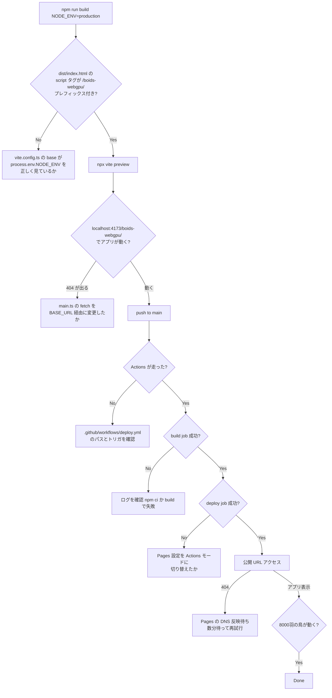

# PR8: GitHub Pages で公開する

> **Done の定義**: `https://kimata1007.github.io/boids-webgpu/` で誰でも 8000 羽の鳥のシミュレーションを動かせる。`LICENSE` ファイルが置かれ、CC-BY 4.0 への準拠が明示される。`main` への push が GitHub Actions で自動デプロイされる

このページの目標: 静的サイト公開で踏みやすい罠（サブパス対応・キャッシュ・WebGPU の HTTPS 要件）を理解し、本リポジトリ固有のデプロイ手順を再現できるようになること。

## なぜこの PR をやるか

PR1〜PR7 で「動くもの」が手元に完成しました。次の自然なステップは「他人に見せる」です。

- **WebGPU は HTTPS 必須**（または localhost のみ）→ HTTP のサーバではブラウザがブロック
- GitHub Pages は無料で HTTPS 提供、CI/CD も統合されており、静的サイト公開の最有力選択肢
- ただしリポジトリ名がパスプレフィックスになる癖があり、何も考えずに `npm run build` した成果物では動かない

ここで「サブパスデプロイ」の問題を一度通しておくと、Vite で作るあらゆる SPA・デモを GitHub Pages に出せるようになります。

## 完了後のイメージ

```
   現在 (private repo, ローカル動作のみ)        PR8 完了後

   git clone -> npm install -> npm run dev      https://kimata1007.github.io/boids-webgpu/
   が必要                                        にアクセスするだけ

   井上さんしか動かせない                          誰でもブラウザで動かせる
```

加えて, リポジトリのトップに **LICENSE ファイル**, **README のライセンス節**, **HUD のクレジット表示**が揃い, CC-BY 4.0 の attribution 義務を満たします。

## 前提知識（初登場の概念）

### 概念 1: GitHub Pages の仕組み

GitHub Pages は GitHub が提供する**静的サイトホスティングサービス**です。

```
通常の Web サイト:
   ┌──────────┐ HTTP request   ┌──────────┐
   │ ブラウザ │ ─────────────→ │ サーバ    │
   │          │ ←───────────── │ (Node等) │
   └──────────┘   HTML/JS/CSS  └──────────┘
                                      │
                               アプリが動的に HTML を生成

GitHub Pages:
   ┌──────────┐                 ┌────────────────┐
   │ ブラウザ │ ──────────────→ │ GitHub の CDN  │
   │          │ ←────────────── │ (静的ファイル)  │
   └──────────┘                 └────────────────┘
                                      │
                               あらかじめビルドした成果物を返すだけ
```

特徴:
- **静的 (static) のみ** — サーバ側の Python/Node コードは動かない
- **HTTPS 自動有効** — Let's Encrypt の証明書が GitHub 側で管理される
- **無料** (public repo の場合)
- **URL は `https://<username>.github.io/<repo>/`** — リポジトリ名がパスに付く

WebGPU を使うアプリは通常「クライアントだけで完結する」ので、静的サイトとして完璧に成立します。

### 概念 2: Vite の `base` 設定とサブパスデプロイ

Vite はデフォルトで HTML/JS/CSS の参照パスを `/` 起点で出力します:

```html
<!-- vite build のデフォルト出力 -->
<script type="module" src="/assets/index-abc123.js"></script>
<link rel="stylesheet" href="/assets/index-abc123.css" />
```

これを `https://kimata1007.github.io/boids-webgpu/` で公開すると、`/assets/index-abc123.js` は `https://kimata1007.github.io/assets/index-abc123.js` を取りに行こうとします。**boids-webgpu パスが抜けて 404**。

解決策は **Vite の `base` オプション**:

```ts
// vite.config.ts
export default defineConfig({
  base: '/boids-webgpu/',
});
```

これでビルド成果物は次のようにプレフィックス付きになります:

```html
<script type="module" src="/boids-webgpu/assets/index-abc123.js"></script>
```

ただし dev サーバ (`npm run dev`) は普通 `/` で動くので、**本番ビルド時のみ `base` を切り替える**のが定石:

```ts
export default defineConfig({
  base: process.env.NODE_ENV === 'production' ? '/boids-webgpu/' : '/',
});
```

### 概念 3: `import.meta.env.BASE_URL` でランタイムからアクセス

Vite は `base` の値をランタイムでも取得できる仕組みを提供します:

```ts
import.meta.env.BASE_URL
// dev:  '/'
// prod: '/boids-webgpu/'
```

主要用途は **`fetch` で動的に取りに行くアセット**のパス解決:

```ts
// before (絶対パス):
fetch('/flying_bird_static.glb')

// after (Vite base 対応):
fetch(import.meta.env.BASE_URL + 'flying_bird_static.glb')
```

`<link>` `<script>` のような静的タグは Vite が自動でプレフィックスを付けますが, `fetch` / `new URL()` などプログラムで作る URL は自動補正されません。

> 💡 ありがちな罠: `BASE_URL` は末尾スラッシュ込み (`/boids-webgpu/`)。連結時に `'/'` を重ねないこと

### 概念 4: GitHub Actions ワークフロー

**GitHub Actions** は GitHub に組み込まれた CI/CD サービスです。`.github/workflows/*.yml` に書かれた手順を、特定のイベント（push, pull_request など）で自動実行します。

```yaml
name: Deploy to GitHub Pages

on:
  push:
    branches: [main]   # main への push でトリガ

jobs:
  build:
    runs-on: ubuntu-latest
    steps:
      - uses: actions/checkout@v4   # コード取得
      - uses: actions/setup-node@v4 # Node 環境構築
        with:
          node-version: 22
      - run: npm ci                 # 依存解決
      - run: npm run build          # Vite ビルド
      - uses: actions/upload-pages-artifact@v3
        with:
          path: dist                # 成果物アップロード

  deploy:
    needs: build
    permissions:
      pages: write
      id-token: write
    steps:
      - uses: actions/deploy-pages@v4   # Pages にデプロイ
```

仕組み:
1. main に push すると Actions が起動
2. ubuntu-latest の VM に Node 22 を入れて build
3. `dist/` の中身をアーティファクトに固める
4. `actions/deploy-pages@v4` が GitHub Pages にアップロード

### 概念 5: Pages の "Source" モード

GitHub Pages は配信ソースを 2 通りから選べます:

| モード | 仕組み | 推奨 |
|---|---|---|
| Branch | `gh-pages` などの専用ブランチに置いた成果物を配信 | 旧来 |
| **Actions** | Actions が作ったアーティファクトを直接配信 | **新規プロジェクトはこちら** |

Actions モードなら専用ブランチを作る必要がなく、ビルド済みファイルを git に含めずに済む。本 PR では Actions モードを使う。

### 概念 6: CC-BY 4.0 をコードに適用する意味

CC-BY 4.0 は本来 creative works（写真・音楽・文書）向けに設計されており、ソフトウェアでは MIT/Apache-2.0/BSD 等が一般的です。

それでも **CC-BY 4.0 をコードに適用することは可能**で、以下の効果があります:

- 利用者は **attribution 必須**（コピーする場合、著者名と出典 URL を明記）
- ライセンス自体に「ソフトウェアには推奨しない」と書かれているが、禁止はされていない
- アセット (`flying_bird.glb`) と同一ライセンスにすることで管理が単純化される

本リポジトリは「学習・デモ目的」のため、利用者にとっての追加負担は許容範囲。**井上さんの指示**でモデルと統一することにしました。

## 実装ステップ

### Step 1: LICENSE ファイル作成

**変更ファイル**: `LICENSE`（新規）

CC-BY 4.0 の公式全文を貼り付けます:

```
Attribution 4.0 International
=======================================================================

(以下、https://creativecommons.org/licenses/by/4.0/legalcode.txt の本文)
```

冒頭にプロジェクトの著作権表記を追加:

```
Copyright (c) 2026 Jundai Inoue (kimata1007)

This work, including both source code and bundled 3D assets, is licensed
under the Creative Commons Attribution 4.0 International License (CC-BY 4.0).

Bundled assets:
- "Flying Bird" by sandeep.s (Sketchfab) — CC-BY 4.0
  https://sketchfab.com/3d-models/flying-bird-eb843194e06d429ebef7dd4aa7e265c1
```

### Step 2: README のライセンス節を更新

**変更ファイル**: `README.md`

「未定」→ CC-BY 4.0 に書き換え:

```markdown
## ライセンス

このプロジェクトは [Creative Commons Attribution 4.0 International (CC-BY 4.0)](./LICENSE) で公開しています。
コード・3D アセット共に同ライセンスです。

利用される場合は以下を表示してください:
- 著者名: Jundai Inoue (kimata1007), sandeep.s (3D モデル)
- 出典 URL: https://github.com/kimata1007/boids-webgpu
- ライセンス: CC-BY 4.0
- 改変有無: 改変している場合はその旨

詳細は [LICENSE](./LICENSE) を参照してください。
```

### Step 3: Vite サブパス対応

**変更ファイル**: `vite.config.ts`（新規）

```ts
import { defineConfig } from 'vite';

export default defineConfig({
  base: process.env.NODE_ENV === 'production' ? '/boids-webgpu/' : '/',
});
```

> 💡 `defineConfig` を使うと型補完が効く。`vite/client` の型定義は `tsconfig.json` の `types` に既に入っている

### Step 4: ランタイム fetch のパス補正

**変更ファイル**: `src/main.ts`

3 箇所の `fetch` を `import.meta.env.BASE_URL` 経由に変更:

```ts
// before
gltf = await loadGLB("/flying_bird_static.glb");
const metaResp = await fetch("/flying_bird_vat.json");
const binResp = await fetch("/flying_bird_vat.bin");

// after
gltf = await loadGLB(import.meta.env.BASE_URL + "flying_bird_static.glb");
const metaResp = await fetch(import.meta.env.BASE_URL + "flying_bird_vat.json");
const binResp = await fetch(import.meta.env.BASE_URL + "flying_bird_vat.bin");
```

> 💡 `BASE_URL` は末尾スラッシュ込み (`/`、`/boids-webgpu/`)。先頭の `/` を取って連結する

### Step 5: GitHub Actions ワークフロー作成

**変更ファイル**: `.github/workflows/deploy.yml`（新規）

```yaml
name: Deploy to GitHub Pages

on:
  push:
    branches: [main]
  workflow_dispatch:

permissions:
  contents: read
  pages: write
  id-token: write

concurrency:
  group: pages
  cancel-in-progress: false

jobs:
  build:
    runs-on: ubuntu-latest
    steps:
      - uses: actions/checkout@v4

      - uses: actions/setup-node@v4
        with:
          node-version: 22
          cache: npm

      - run: npm ci

      - run: npm run build
        env:
          NODE_ENV: production

      - uses: actions/upload-pages-artifact@v3
        with:
          path: dist

  deploy:
    needs: build
    runs-on: ubuntu-latest
    environment:
      name: github-pages
      url: ${{ steps.deployment.outputs.page_url }}
    steps:
      - id: deployment
        uses: actions/deploy-pages@v4
```

ポイント:
- `concurrency` で複数の push が重なっても古いデプロイをキャンセルしない（直列処理）
- `permissions` で Pages 関連のスコープのみを与える
- ジョブを `build` と `deploy` で分け, 公開権限を `deploy` のみに限定

### Step 6: ローカル検証

```bash
# 開発時の挙動を確認 (base = '/')
npm run dev
# → http://localhost:5173/ で動く

# 本番ビルドを試す
NODE_ENV=production npm run build
# → dist/ に成果物。HTML の <script src> が /boids-webgpu/... になっているか確認

# 本番ビルドを Vite preview で配信
npx vite preview
# → http://localhost:4173/boids-webgpu/ で動く
```

### Step 7: PR 作成 → レビュー → マージ

実装完了後にコミット, push, `gh pr create` で PR を起こす。

### Step 8: リポジトリ公開（井上さん側で実施）

**ここから先は不可逆操作なので私からは実行しない**。井上さんに以下を実施してもらう:

```bash
# 1. リポジトリを public に変更
gh repo edit kimata1007/boids-webgpu \
  --visibility public \
  --accept-visibility-change-consequences

# 2. Pages を有効化（または GitHub UI で）
gh api -X POST repos/kimata1007/boids-webgpu/pages \
  -f build_type=workflow

# 3. main への push を待つ → Actions が走る → Pages にデプロイ
gh run watch  # または GitHub UI の Actions タブで確認

# 4. 公開 URL でアクセス確認
open https://kimata1007.github.io/boids-webgpu/
```

> ⚠️ public 化すると履歴・PR・Issue が全世界公開になります。一度公開したものは、その間に fork された分は private に戻しても回収できません

## 検証方法



## トラブルシュート

| 症状 | 原因 |
|------|------|
| 公開 URL で `/assets/index-xxx.js` が 404 | `vite.config.ts` の `base` が未設定または `/` のままビルドされた |
| 公開 URL でアプリは出るが鳥が描画されない | `fetch('/flying_bird_static.glb')` のままで base prefix が抜けている |
| Actions の build job で `npm ci` が失敗 | `package-lock.json` が古い → ローカルで `npm install` し直してコミット |
| Actions の deploy job で permission denied | Settings > Pages > Source が "Branch" のまま → "GitHub Actions" に切替え |
| WebGPU エラー "navigator.gpu is undefined" | HTTP でアクセス（Pages は HTTPS だが手元の `vite preview` は HTTP）→ HTTPS で試す or localhost を使う |
| キャッシュで古い `.glb` が返る | Pages の CDN キャッシュ。`<filename>?v=2` のようにクエリ付与か、ファイル名にハッシュを付ける |
| Pages の URL が `/<repo>` で表示できない | Settings > Pages の "Source" が "GitHub Actions" になっているか再確認 |

## 学べること

- **GitHub Pages** の仕組みと制約（静的限定、サブパス）
- **Vite の `base` 設定**と本番/開発の切り替え
- **`import.meta.env.BASE_URL`** をランタイムで使う場面
- **GitHub Actions のワークフロー**を YAML で書く基礎
- **Pages の Source モード**の選択
- **CC-BY 4.0 をコード+アセットに統一**するライセンス運用
- **静的 SPA を CDN にデプロイする**実務的な流れ

## 次の PR

特になし。本 PR で「学習プロジェクトとしての完成」と位置付けます。

公開後の改善候補（やる場合は新たに PR 設計書を起こす）:
- 空間ハッシュで Boid 計算を O(N²) → O(N) に → 100k 羽
- スカイドーム / 影 / 大気散乱で見栄え向上
- スマホ向け WebGPU 対応（タッチ操作）
- VAT のみならず法線 VAT も追加してライティングを改善
